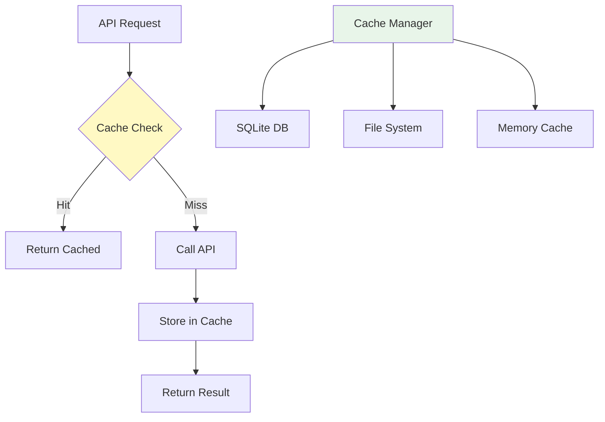

# Caching Strategy

Git AI Reporter implements a sophisticated multi-layer caching system that reduces API costs by up to 70% while maintaining data freshness.

## Overview

The caching system operates at three levels:

1. **Commit Analysis Cache**: Individual commit AI analyses
2. **Daily Summary Cache**: Synthesized daily summaries  
3. **Weekly Narrative Cache**: Generated narratives and changelogs



## Cache Architecture

### Storage Backends

```python
class CacheManager:
    """Multi-backend cache management system."""
    
    def __init__(self, config: CacheConfig):
        self.config = config
        
        # Primary: SQLite for structured data
        self.db_cache = SQLiteCache(
            path=config.cache_dir / "cache.db",
            max_size_mb=config.max_db_size
        )
        
        # Secondary: File system for large objects
        self.file_cache = FileCache(
            directory=config.cache_dir / "files",
            max_size_mb=config.max_file_size
        )
        
        # Tertiary: Memory for hot data
        self.memory_cache = MemoryCache(
            max_items=config.max_memory_items,
            ttl_seconds=config.memory_ttl
        )
```

### Cache Key Generation

Cache keys are deterministic and content-based:

```python
def generate_cache_key(self, request_type: str, content: dict) -> str:
    """Generate deterministic cache key."""
    # Create canonical representation
    canonical = {
        'type': request_type,
        'content': self.canonicalize(content),
        'version': self.CACHE_VERSION
    }
    
    # Generate SHA-256 hash
    content_str = json.dumps(canonical, sort_keys=True)
    hash_obj = hashlib.sha256(content_str.encode())
    
    # Prefix with type for organization
    return f"{request_type}:{hash_obj.hexdigest()}"
```

## Layer 1: Commit Analysis Cache

### Purpose
Cache individual commit AI analyses to avoid re-processing unchanged commits.

### Implementation

```python
class CommitAnalysisCache:
    """Cache for Tier 1 commit analyses."""
    
    def get_or_analyze(self, commit, analyzer):
        """Get cached analysis or generate new."""
        # Generate cache key from commit content
        cache_key = self.generate_commit_key(commit)
        
        # Check cache
        cached = self.cache_manager.get(
            key=cache_key,
            cache_type='commit_analysis'
        )
        
        if cached and self.is_valid(cached):
            self.stats.record_hit()
            return cached['data']
        
        # Cache miss - analyze
        self.stats.record_miss()
        analysis = analyzer.analyze_commit(commit)
        
        # Store in cache
        self.cache_manager.set(
            key=cache_key,
            value={
                'data': analysis,
                'commit_sha': commit.hexsha,
                'timestamp': datetime.now(),
                'prompt_version': analyzer.PROMPT_VERSION
            },
            ttl=self.config.commit_ttl  # 30 days default
        )
        
        return analysis
    
    def generate_commit_key(self, commit):
        """Generate cache key for commit."""
        # Include factors that affect analysis
        factors = {
            'sha': commit.hexsha,
            'diff': self.get_commit_diff_hash(commit),
            'prompt_version': self.PROMPT_VERSION,
            'model': self.config.tier1_model
        }
        return self.hash_factors(factors)
```

### Cache Invalidation

Commits are cached with these rules:

```python
def is_valid(self, cached_entry):
    """Determine if cached entry is still valid."""
    # Check age
    age = datetime.now() - cached_entry['timestamp']
    if age > timedelta(seconds=self.config.commit_ttl):
        return False
    
    # Check prompt version
    if cached_entry.get('prompt_version') != self.PROMPT_VERSION:
        return False
    
    # Check model version
    if cached_entry.get('model') != self.config.tier1_model:
        return False
    
    return True
```

### Statistics

| Metric | Typical Value | Impact |
|--------|--------------|--------|
| Hit Rate | 70-80% | Reduces API calls |
| Avg Latency (Hit) | Low | Much faster than API |
| Avg Latency (Miss) | Higher | API call required |
| Storage Size | Varies | Depends on commit size |

## Layer 2: Daily Summary Cache

### Purpose
Cache synthesized daily summaries to avoid re-processing days with no new commits.

### Implementation

```python
class DailySummaryCache:
    """Cache for Tier 2 daily syntheses."""
    
    def get_or_synthesize(self, date, commits, synthesizer):
        """Get cached summary or generate new."""
        # Generate cache key from date and commits
        cache_key = self.generate_daily_key(date, commits)
        
        # Check cache with shorter TTL
        cached = self.cache_manager.get(
            key=cache_key,
            cache_type='daily_summary'
        )
        
        if cached and self.is_recent(cached, days=7):
            return cached['data']
        
        # Synthesize new summary
        summary = synthesizer.synthesize_day(date, commits)
        
        # Cache with metadata
        self.cache_manager.set(
            key=cache_key,
            value={
                'data': summary,
                'date': date.isoformat(),
                'commit_count': len(commits),
                'commit_shas': [c.hexsha for c in commits],
                'timestamp': datetime.now()
            },
            ttl=self.config.daily_ttl  # 7 days default
        )
        
        return summary
    
    def generate_daily_key(self, date, commits):
        """Generate cache key for daily summary."""
        # Key based on date and commit content
        factors = {
            'date': date.isoformat(),
            'commit_shas': sorted([c.hexsha for c in commits]),
            'model': self.config.tier2_model,
            'synthesis_version': self.SYNTHESIS_VERSION
        }
        return self.hash_factors(factors)
```

### Invalidation Strategy

Daily summaries expire faster than commit analyses:

```python
def should_invalidate_daily(self, cached_entry, current_date):
    """Determine if daily cache should be invalidated."""
    # Recent days expire faster (might get new commits)
    entry_date = datetime.fromisoformat(cached_entry['date'])
    days_old = (current_date - entry_date).days
    
    if days_old <= 1:
        return True  # Today and yesterday always fresh
    elif days_old <= 7:
        ttl = timedelta(days=3)  # Recent week: 3 day cache
    else:
        ttl = timedelta(days=7)  # Older: 7 day cache
    
    age = datetime.now() - cached_entry['timestamp']
    return age > ttl
```

## Layer 3: Weekly Narrative Cache

### Purpose
Cache final generated documents for quick retrieval.

### Implementation

```python
class WeeklyNarrativeCache:
    """Cache for Tier 3 narratives."""
    
    def get_or_generate(self, week_data, narrator):
        """Get cached narrative or generate new."""
        # Generate cache key from week data
        cache_key = self.generate_weekly_key(week_data)
        
        # Check cache with short TTL
        cached = self.cache_manager.get(
            key=cache_key,
            cache_type='weekly_narrative'
        )
        
        if cached and self.is_recent(cached, days=3):
            return cached['data']
        
        # Generate new narrative
        narrative = narrator.generate_narrative(week_data)
        
        # Cache the result
        self.cache_manager.set(
            key=cache_key,
            value={
                'data': narrative,
                'week_start': week_data.start_date,
                'week_end': week_data.end_date,
                'generation_time': datetime.now(),
                'statistics': week_data.statistics
            },
            ttl=self.config.weekly_ttl  # 3 days default
        )
        
        return narrative
```

### Document-Specific Caching

Different documents have different cache strategies:

```python
class DocumentCache:
    """Document-specific caching strategies."""
    
    def cache_news(self, content, metadata):
        """Cache NEWS.md with metadata."""
        return self.cache_manager.set(
            key=f"news:{metadata['week_id']}",
            value={
                'content': content,
                'format': 'markdown',
                'audience': 'stakeholders',
                'generated': datetime.now()
            },
            ttl=timedelta(days=3)
        )
    
    def cache_changelog(self, content, metadata):
        """Cache CHANGELOG.txt with structure."""
        return self.cache_manager.set(
            key=f"changelog:{metadata['week_id']}",
            value={
                'content': content,
                'format': 'keep-a-changelog',
                'categories': self.extract_categories(content),
                'generated': datetime.now()
            },
            ttl=timedelta(days=3)
        )
```

## Cache Management

### Size Management

```python
class CacheSizeManager:
    """Manages cache size and cleanup."""
    
    def __init__(self, max_size_mb=500):
        self.max_size_mb = max_size_mb
        
    def check_and_cleanup(self):
        """Check size and cleanup if needed."""
        current_size = self.calculate_cache_size()
        
        if current_size > self.max_size_mb:
            self.cleanup_old_entries()
    
    def cleanup_old_entries(self):
        """Remove old entries using LRU strategy."""
        entries = self.get_all_entries_sorted_by_access()
        
        target_size = self.max_size_mb * 0.7  # Clean to 70%
        current_size = self.calculate_cache_size()
        
        for entry in entries:
            if current_size <= target_size:
                break
                
            self.delete_entry(entry)
            current_size -= entry.size
```

### Cache Warming

Pre-populate cache for better performance:

```python
async def warm_cache(self, repo_path, days=30):
    """Pre-populate cache with recent commits."""
    repo = Repo(repo_path)
    
    # Get recent commits
    since = datetime.now() - timedelta(days=days)
    commits = list(repo.iter_commits(since=since))
    
    # Analyze in parallel with progress bar
    tasks = []
    with tqdm(total=len(commits), desc="Warming cache") as pbar:
        for commit in commits:
            task = self.analyze_commit_async(commit)
            task.add_done_callback(lambda _: pbar.update(1))
            tasks.append(task)
        
        await asyncio.gather(*tasks)
```

### Cache Export/Import

Share cache between team members:

```python
class CachePortability:
    """Export and import cache data."""
    
    def export_cache(self, output_path):
        """Export cache to compressed archive."""
        with tarfile.open(output_path, 'w:gz') as tar:
            # Add SQLite database
            tar.add(self.db_path, arcname='cache.db')
            
            # Add file cache
            tar.add(self.file_cache_dir, arcname='files')
            
            # Add metadata
            metadata = {
                'export_date': datetime.now().isoformat(),
                'version': self.CACHE_VERSION,
                'statistics': self.get_cache_statistics()
            }
            self.add_json_to_tar(tar, metadata, 'metadata.json')
    
    def import_cache(self, archive_path):
        """Import cache from archive."""
        with tarfile.open(archive_path, 'r:gz') as tar:
            # Verify version compatibility
            metadata = self.extract_metadata(tar)
            if not self.is_compatible(metadata['version']):
                raise IncompatibleCacheError()
            
            # Extract cache data
            tar.extractall(self.cache_dir)
            
            # Rebuild indexes
            self.rebuild_cache_indexes()
```

## Cache Benefits

### Response Times

```python
# Cache performance characteristics
CACHE_PERFORMANCE = {
    'cache_hit': {
        # Near-instant retrieval from local storage
        'description': 'Retrieved from local cache'
    },
    'cache_miss': {
        'description': 'Requires API call to Gemini'
    },
    'benefit': 'Significant reduction in API calls'
}
```

### Storage Requirements

| Data Type | Size per Item | Items Cached | Total Size |
|-----------|--------------|--------------|------------|
| Commit Analysis | 10 KB | 10,000 | 100 MB |
| Daily Summary | 50 KB | 365 | 18 MB |
| Weekly Narrative | 100 KB | 52 | 5 MB |
| Indexes | - | - | 10 MB |
| **Total** | | | **~135 MB/year** |

## Configuration

### Cache Settings

```yaml
cache:
  enabled: true
  directory: .cache/git-ai
  
  # TTL settings (seconds)
  ttl_commit: 2592000     # 30 days
  ttl_daily: 604800       # 7 days
  ttl_weekly: 259200      # 3 days
  
  # Size limits
  max_size_mb: 500
  max_db_size_mb: 400
  max_file_size_mb: 100
  
  # Memory cache
  memory_cache_items: 1000
  memory_cache_ttl: 3600  # 1 hour
  
  # Cleanup
  cleanup_interval: 86400  # Daily
  cleanup_threshold: 0.9   # Clean at 90% full
```

### Tuning Parameters

```python
# Performance tuning
config.cache.optimization = {
    'use_compression': True,           # Compress cached data
    'compression_level': 6,            # zlib compression level
    'use_bloom_filter': True,          # Fast existence checks
    'bloom_filter_size': 100000,       # Number of items
    'use_connection_pool': True,       # SQLite connection pooling
    'pool_size': 5,                    # Connection pool size
    'enable_wal_mode': True,           # Write-ahead logging
    'page_size': 4096,                 # SQLite page size
    'cache_query_plans': True          # Cache SQL query plans
}
```

## Cache Strategies

### Aggressive Caching

For stable repositories with infrequent changes:

```python
# Long TTLs, high memory usage
aggressive_config = {
    'ttl_commit': 5184000,    # 60 days
    'ttl_daily': 2592000,     # 30 days
    'ttl_weekly': 604800,     # 7 days
    'memory_cache_items': 5000,
    'max_size_mb': 2000
}
```

### Conservative Caching

For active repositories with frequent changes:

```python
# Short TTLs, low memory usage
conservative_config = {
    'ttl_commit': 86400,      # 1 day
    'ttl_daily': 43200,       # 12 hours
    'ttl_weekly': 21600,      # 6 hours
    'memory_cache_items': 100,
    'max_size_mb': 100
}
```

### Adaptive Caching

Automatically adjust based on repository activity:

```python
class AdaptiveCacheStrategy:
    """Dynamically adjust cache parameters."""
    
    def adjust_ttl(self, commit_frequency):
        """Adjust TTL based on commit frequency."""
        if commit_frequency < 10:  # commits/day
            return self.long_ttl_config
        elif commit_frequency < 50:
            return self.medium_ttl_config
        else:
            return self.short_ttl_config
    
    def monitor_and_adapt(self):
        """Monitor cache performance and adapt."""
        metrics = self.collect_metrics()
        
        # Adjust based on hit rate
        if metrics.hit_rate < 0.5:
            self.reduce_ttl()  # Data changing too fast
        elif metrics.hit_rate > 0.9:
            self.increase_ttl()  # Data stable
        
        # Adjust based on size
        if metrics.size_ratio > 0.8:
            self.trigger_cleanup()
```

## Related Documentation

- [Three-Tier AI Architecture](three-tier-ai.md)
- [Performance Optimization](../guide/performance.md)
- [Configuration Guide](../guide/configuration.md)
- [Troubleshooting](../guide/troubleshooting.md)