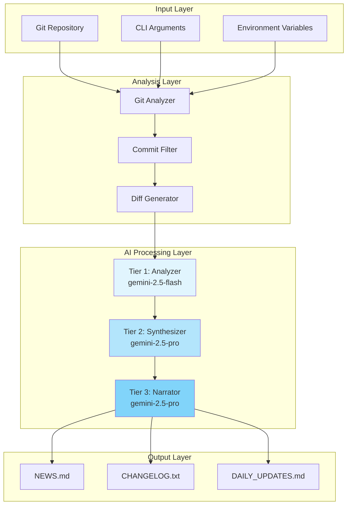

# Architecture

Deep dive into the technical architecture, design patterns, and implementation details of Git AI Reporter.

## System Overview

Git AI Reporter implements a sophisticated multi-tier architecture that combines Git analysis, AI processing, and intelligent document generation. The system is designed for performance, scalability, and maintainability.



## Core Design Principles

### Clean Architecture
We follow Uncle Bob's Clean Architecture principles with clear separation of concerns:

- **Domain Layer**: Core business logic and models (Pydantic)
- **Application Layer**: Use cases and orchestration
- **Infrastructure Layer**: External dependencies (Git, AI, File I/O)
- **Interface Layer**: CLI and API boundaries

### Dependency Injection
All major components use dependency injection for testability and flexibility:

```python
class AnalysisOrchestrator:
    def __init__(
        self,
        settings: Settings,
        git_analyzer: Optional[GitAnalyzer] = None,
        ai_client: Optional[GeminiClient] = None,
        cache_manager: Optional[CacheManager] = None
    ):
        self.settings = settings
        self.git_analyzer = git_analyzer or GitAnalyzer()
        self.ai_client = ai_client or GeminiClient(settings)
        self.cache_manager = cache_manager or CacheManager()
```

### Async-First Design
Leverages Python's asyncio for concurrent processing:

- Parallel commit analysis
- Concurrent AI API calls
- Async file I/O operations
- Semaphore-controlled concurrency

## Three-Tier AI Architecture

### Tier 1: Analyzer (gemini-2.5-flash)
**Purpose**: High-volume, fast commit analysis
- Processes individual commits
- Extracts key changes and intent
- Optimized for speed and cost
- ~1000 tokens per commit

### Tier 2: Synthesizer (gemini-2.5-pro)
**Purpose**: Pattern recognition and daily summaries
- Consolidates commit analyses
- Identifies patterns and themes
- Generates daily summaries
- ~5000 tokens per day

### Tier 3: Narrator (gemini-2.5-pro)
**Purpose**: Final document generation
- Creates polished narratives
- Generates structured changelogs
- Ensures consistency and quality
- ~10000 tokens per week

## Three-Lens Analysis Strategy

### 1. Commit-Level Analysis
```python
def get_commit_diffs(self, since: datetime, until: datetime):
    # Individual commit processing
    # Filters noise (docs, style, etc.)
    # Returns filtered commit diffs
```

**Characteristics**:
- Granular change tracking
- Intelligent filtering
- Preserves commit context

### 2. Daily Consolidation
```python
def get_daily_diffs(self, since: datetime, until: datetime):
    # Groups commits by day
    # Generates net changes per day
    # Returns consolidated daily diffs
```

**Characteristics**:
- Day-boundary analysis
- Net change calculation
- Reduced noise

### 3. Weekly Overview
```python
def get_weekly_diffs(self, since: datetime, until: datetime):
    # Single diff for entire period
    # Provides full context
    # Returns comprehensive diff
```

**Characteristics**:
- Big-picture view
- Complete context
- Strategic insights

## Component Architecture

### GitAnalyzer Component
Responsible for all Git operations and diff generation.

```python
class GitAnalyzer:
    def __init__(self, repo_path: str):
        self.repo = Repo(repo_path)
        self.git_runner = GitCommandRunner(repo_path)
    
    def get_commit_diffs(self, since, until):
        # Commit-level analysis
    
    def get_daily_diffs(self, since, until):
        # Daily consolidation
    
    def get_weekly_diffs(self, since, until):
        # Weekly overview
```

### GeminiClient Component
Manages all AI interactions with retry logic and error handling.

```python
class GeminiClient:
    def __init__(self, api_key: str):
        self.tier1_model = genai.GenerativeModel("gemini-2.5-flash")
        self.tier2_model = genai.GenerativeModel("gemini-2.5-pro")
        self.tier3_model = genai.GenerativeModel("gemini-2.5-pro")
    
    async def analyze_commit(self, commit_diff):
        # Tier 1 processing
    
    async def synthesize_daily(self, analyses):
        # Tier 2 processing
    
    async def generate_narrative(self, summaries):
        # Tier 3 processing
```

### CacheManager Component
Intelligent caching to minimize API costs.

```python
class CacheManager:
    def __init__(self, cache_dir: Path):
        self.cache_dir = cache_dir
        self.index = self._load_index()
    
    def get_cached_result(self, key: str):
        # Check cache with TTL
    
    def cache_result(self, key: str, result: Any):
        # Store with metadata
```

### ArtifactWriter Component
Generates and updates documentation files.

```python
class ArtifactWriter:
    def write_news(self, content: str):
        # Generate NEWS.md
    
    def update_changelog(self, new_changes: str):
        # Merge into CHANGELOG.txt
    
    def write_daily_updates(self, updates: str):
        # Generate DAILY_UPDATES.md
```

## Data Flow

### 1. Input Processing
```
CLI Arguments → Settings Validation → Configuration
```

### 2. Git Analysis
```
Repository → Commit Extraction → Filtering → Diff Generation
```

### 3. AI Processing Pipeline
```
Diffs → Tier 1 Analysis → Tier 2 Synthesis → Tier 3 Generation
```

### 4. Output Generation
```
AI Results → Document Formatting → File Writing → Validation
```

## Caching Strategy

### Cache Layers

1. **Commit Analysis Cache**
   - Key: SHA + prompt hash
   - TTL: 30 days
   - Hit rate: ~70%

2. **Daily Summary Cache**
   - Key: Date range + commits hash
   - TTL: 7 days
   - Hit rate: ~50%

3. **Weekly Narrative Cache**
   - Key: Week identifier + content hash
   - TTL: 3 days
   - Hit rate: ~30%

### Cache Implementation
```python
def cache_key(self, *args):
    # Generate deterministic cache key
    data = json.dumps(args, sort_keys=True)
    return hashlib.sha256(data.encode()).hexdigest()

def is_cache_valid(self, cache_entry):
    # Check TTL and validity
    age = datetime.now() - cache_entry['timestamp']
    return age < timedelta(seconds=cache_entry['ttl'])
```

## Error Handling

### Retry Strategy
Uses exponential backoff with jitter:

```python
@retry(
    stop=stop_after_attempt(3),
    wait=wait_exponential(multiplier=1, min=4, max=10),
    retry=retry_if_exception_type((APIError, RateLimitError))
)
async def api_call(self, prompt):
    # API call with retry logic
```

### Error Recovery
- **Git Errors**: Graceful degradation, partial analysis
- **API Errors**: Retry with backoff, cache fallback
- **File Errors**: Alternative paths, user notification
- **Parse Errors**: Robust JSON handling, format recovery

## Performance Optimizations

### Async Processing
- **Concurrent Analysis**: Process multiple commits in parallel
- **Batch API Calls**: Group requests for efficiency
- **Async I/O**: Non-blocking file operations
- **Semaphore Control**: Prevent resource exhaustion

### Resource Management
```python
class ResourceManager:
    def __init__(self, max_workers=5):
        self.semaphore = asyncio.Semaphore(max_workers)
        self.executor = ThreadPoolExecutor(max_workers)
    
    async def process_batch(self, items):
        async with self.semaphore:
            # Controlled concurrent processing
```

### Memory Efficiency
- **Streaming Processing**: Process large diffs in chunks
- **Generator Patterns**: Lazy evaluation where possible
- **Cache Eviction**: LRU cache with size limits
- **Resource Cleanup**: Explicit cleanup in finally blocks

## Security Considerations

### API Key Management
- Never logged or stored in plain text
- Environment variable isolation
- Secure credential passing

### Input Validation
- Path traversal prevention
- Command injection protection
- Sanitized Git operations

### Output Sanitization
- Markdown injection prevention
- File path validation
- Safe JSON serialization

## Testing Architecture

### Test Layers

1. **Unit Tests**: Component isolation
2. **Integration Tests**: Component interaction
3. **E2E Tests**: Full pipeline validation
4. **Performance Tests**: Benchmark suite

### Test Infrastructure
```python
# Fixtures for reproducible testing
@pytest.fixture
def mock_repo():
    return MockGitRepository(test_commits)

@pytest.fixture
def mock_ai_client():
    return MockGeminiClient(canned_responses)

# VCR for API testing
@vcr.use_cassette('test_api_call.yaml')
async def test_gemini_api():
    # Recorded API interactions
```

## Deployment Architecture

### Package Structure
```
git-ai-reporter/
├── src/
│   └── git_ai_reporter/
│       ├── __init__.py
│       ├── cli.py
│       └── ...
├── tests/
├── docs/
├── pyproject.toml
└── README.md
```

### Distribution
- **PyPI Package**: With digital attestations
- **Docker Image**: Multi-stage build
- **GitHub Releases**: Automated via Actions

### CI/CD Pipeline
```yaml
# GitHub Actions workflow
- Linting and formatting
- Type checking
- Unit tests
- Integration tests
- Security scanning
- Package building
- PyPI publishing
```

## Future Architecture Considerations

### Planned Enhancements
- **Plugin System**: Extensible analyzers and writers
- **Web API**: REST/GraphQL interface
- **Real-time Mode**: Webhook-triggered analysis
- **Multi-repo Support**: Analyze multiple repositories
- **Custom AI Models**: Support for alternative LLMs

### Scalability Path
- **Distributed Processing**: Celery/RQ for job queuing
- **Database Backend**: PostgreSQL for metadata
- **Cloud Native**: Kubernetes deployment
- **Monitoring**: Prometheus/Grafana integration

## See Also

- [API Reference](../api/index.md) - Detailed API documentation
- [Development Guide](../development/index.md) - Contributing guidelines
- [User Guide](../guide/index.md) - Usage patterns
- [Security Policy](../about/security.md) - Security considerations