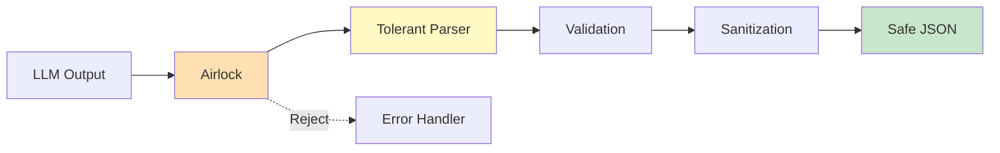

# JSON Handling: The Airlock Pattern

Git AI Reporter implements a robust JSON handling system called the "Airlock Pattern" to safely process potentially imperfect JSON output from Large Language Models.

## The Problem

LLMs often produce JSON that is:
- Missing quotes around keys
- Using single quotes instead of double quotes
- Including trailing commas
- Containing comments
- Having undefined values
- Missing closing brackets
- Including special characters

```python
# Example of problematic LLM JSON output
llm_output = """
{
    'summary': "User's authentication system",  // Added auth
    features: [
        "Login functionality",
        "Password reset",
    ],
    undefined_field: undefined,
    success: true
}
"""
```

## The Airlock Pattern

The Airlock Pattern provides a safe zone between untrusted LLM output and the application's strict JSON requirements.



## Implementation

### Core Functions

```python
# utils/json_helpers.py

import json
import re
from datetime import datetime, date
from decimal import Decimal
from typing import Any, Dict, Optional
import logging

logger = logging.getLogger(__name__)

def tolerate(json_string: str) -> Optional[Dict[str, Any]]:
    """
    Parse potentially malformed JSON with tolerance.
    
    The "Airlock" pattern - safely process untrusted JSON.
    
    Args:
        json_string: Potentially malformed JSON string
        
    Returns:
        Parsed JSON as dict, or None if unparseable
    """
    if not json_string:
        return None
    
    # Try standard parsing first
    try:
        return json.loads(json_string)
    except json.JSONDecodeError:
        pass
    
    # Apply progressive fixes
    fixed = json_string
    
    # Step 1: Remove comments
    fixed = remove_comments(fixed)
    
    # Step 2: Fix quotes
    fixed = fix_quotes(fixed)
    
    # Step 3: Fix undefined/null values
    fixed = fix_undefined(fixed)
    
    # Step 4: Fix trailing commas
    fixed = fix_trailing_commas(fixed)
    
    # Step 5: Fix unquoted keys
    fixed = fix_unquoted_keys(fixed)
    
    # Step 6: Attempt to parse again
    try:
        return json.loads(fixed)
    except json.JSONDecodeError as e:
        logger.warning(f"Failed to parse JSON after fixes: {e}")
        
        # Step 7: Last resort - extract valid JSON subset
        return extract_valid_json(json_string)
```

### Progressive Fixing Strategy

#### Step 1: Remove Comments

```python
def remove_comments(json_string: str) -> str:
    """Remove JavaScript-style comments from JSON."""
    # Remove single-line comments
    json_string = re.sub(r'//.*?$', '', json_string, flags=re.MULTILINE)
    
    # Remove multi-line comments
    json_string = re.sub(r'/\*.*?\*/', '', json_string, flags=re.DOTALL)
    
    return json_string
```

#### Step 2: Fix Quotes

```python
def fix_quotes(json_string: str) -> str:
    """Convert single quotes to double quotes carefully."""
    # State machine to track if we're inside a string
    result = []
    in_string = False
    escape_next = False
    current_quote = None
    
    for i, char in enumerate(json_string):
        if escape_next:
            result.append(char)
            escape_next = False
            continue
            
        if char == '\\':
            escape_next = True
            result.append(char)
            continue
        
        if not in_string:
            if char == '"':
                in_string = True
                current_quote = '"'
                result.append(char)
            elif char == "'":
                # Convert single quote to double quote
                in_string = True
                current_quote = "'"
                result.append('"')
            else:
                result.append(char)
        else:
            if char == current_quote and not escape_next:
                in_string = False
                result.append('"' if current_quote == "'" else char)
                current_quote = None
            elif char == '"' and current_quote == "'":
                # Escape double quotes inside single-quoted strings
                result.append('\\"')
            else:
                result.append(char)
    
    return ''.join(result)
```

#### Step 3: Fix Undefined Values

```python
def fix_undefined(json_string: str) -> str:
    """Replace JavaScript undefined with null."""
    # Replace undefined with null
    json_string = re.sub(r'\bundefined\b', 'null', json_string)
    
    # Replace NaN with null
    json_string = re.sub(r'\bNaN\b', 'null', json_string)
    
    # Replace Infinity with large number
    json_string = re.sub(r'\bInfinity\b', '999999999', json_string)
    
    return json_string
```

#### Step 4: Fix Trailing Commas

```python
def fix_trailing_commas(json_string: str) -> str:
    """Remove trailing commas before closing brackets."""
    # Remove comma before }
    json_string = re.sub(r',\s*}', '}', json_string)
    
    # Remove comma before ]
    json_string = re.sub(r',\s*]', ']', json_string)
    
    return json_string
```

#### Step 5: Fix Unquoted Keys

```python
def fix_unquoted_keys(json_string: str) -> str:
    """Add quotes to unquoted object keys."""
    # Match unquoted keys (word characters followed by colon)
    pattern = r'([,\{\s])([a-zA-Z_][a-zA-Z0-9_]*)\s*:'
    
    def replacer(match):
        prefix = match.group(1)
        key = match.group(2)
        return f'{prefix}"{key}":'
    
    return re.sub(pattern, replacer, json_string)
```

### Safe Serialization

```python
def safe_json_dumps(obj: Any, **kwargs) -> str:
    """
    Safely serialize objects to JSON, handling special types.
    
    Args:
        obj: Object to serialize
        **kwargs: Additional arguments for json.dumps
        
    Returns:
        JSON string
    """
    
    class SafeEncoder(json.JSONEncoder):
        """Custom encoder for special types."""
        
        def default(self, obj):
            # Handle datetime objects
            if isinstance(obj, (datetime, date)):
                return obj.isoformat()
            
            # Handle Decimal
            if isinstance(obj, Decimal):
                return float(obj)
            
            # Handle Path objects
            if hasattr(obj, '__fspath__'):
                return str(obj)
            
            # Handle dataclasses
            if hasattr(obj, '__dataclass_fields__'):
                return {
                    f.name: getattr(obj, f.name)
                    for f in obj.__dataclass_fields__.values()
                }
            
            # Handle Pydantic models
            if hasattr(obj, 'model_dump'):
                return obj.model_dump()
            
            # Handle sets
            if isinstance(obj, set):
                return list(obj)
            
            # Handle bytes
            if isinstance(obj, bytes):
                return obj.decode('utf-8', errors='replace')
            
            # Default to string representation
            try:
                return str(obj)
            except:
                return f"<unserializable: {type(obj).__name__}>"
    
    # Set default parameters
    kwargs.setdefault('cls', SafeEncoder)
    kwargs.setdefault('indent', 2)
    kwargs.setdefault('ensure_ascii', False)
    
    return json.dumps(obj, **kwargs)
```

### Validation Layer

```python
def validate_json_schema(data: Dict[str, Any], schema: Dict[str, Any]) -> bool:
    """
    Validate JSON data against a schema.
    
    Args:
        data: JSON data to validate
        schema: JSON schema
        
    Returns:
        True if valid, False otherwise
    """
    try:
        import jsonschema
        jsonschema.validate(instance=data, schema=schema)
        return True
    except jsonschema.exceptions.ValidationError as e:
        logger.error(f"Schema validation failed: {e}")
        return False
    except ImportError:
        logger.warning("jsonschema not installed, skipping validation")
        return True
```

### Error Recovery

```python
def extract_valid_json(text: str) -> Optional[Dict[str, Any]]:
    """
    Extract valid JSON objects from text.
    
    Last resort method to salvage JSON from corrupted output.
    
    Args:
        text: Text potentially containing JSON
        
    Returns:
        First valid JSON object found, or None
    """
    # Look for JSON-like structures
    patterns = [
        r'\{[^{}]*\}',  # Simple object
        r'\{.*?\}',      # Nested object (non-greedy)
        r'\[.*?\]',      # Array
    ]
    
    for pattern in patterns:
        matches = re.finditer(pattern, text, re.DOTALL)
        for match in matches:
            try:
                potential_json = match.group(0)
                # Try to parse it
                result = json.loads(potential_json)
                if isinstance(result, (dict, list)):
                    return result
            except:
                continue
    
    # Try to extract key-value pairs
    return extract_key_value_pairs(text)

def extract_key_value_pairs(text: str) -> Optional[Dict[str, Any]]:
    """Extract key-value pairs from text."""
    result = {}
    
    # Look for patterns like "key": "value" or 'key': 'value'
    pattern = r'["\']([^"\']+)["\']\s*:\s*["\']([^"\']+)["\']'
    matches = re.findall(pattern, text)
    
    for key, value in matches:
        result[key] = value
    
    return result if result else None
```

## Usage Examples

### Basic Usage

```python
from git_ai_reporter.utils import tolerate, safe_json_dumps

# Parse potentially malformed JSON from LLM
llm_response = """
{
    summary: "Fixed authentication bug",
    changes: ['auth.py', 'tests.py'],
    impact: 'high',
    undefined_field: undefined,
}
"""

parsed = tolerate(llm_response)
if parsed:
    print(f"Summary: {parsed.get('summary')}")
    print(f"Impact: {parsed.get('impact')}")

# Safely serialize complex objects
data = {
    'timestamp': datetime.now(),
    'decimal_value': Decimal('10.5'),
    'path': Path('/home/user'),
    'custom_object': MyCustomClass()
}

json_str = safe_json_dumps(data)
```

### Integration with AI Processing

```python
class GeminiClient:
    """AI client with robust JSON handling."""
    
    async def generate_json(self, prompt: str) -> Dict[str, Any]:
        """Generate and parse JSON from AI."""
        # Request JSON from AI
        response = await self.generate_content(
            prompt + "\n\nReturn response as JSON."
        )
        
        # Use airlock pattern to parse
        parsed = tolerate(response.text)
        
        if not parsed:
            # Fallback: Try to extract structured data
            parsed = self.extract_structured_data(response.text)
        
        if not parsed:
            raise ValueError("Failed to parse AI response as JSON")
        
        # Validate against expected schema
        if not self.validate_response(parsed):
            logger.warning("Response doesn't match expected schema")
        
        return parsed
```

### Error Handling

```python
def process_llm_json(json_string: str) -> Dict[str, Any]:
    """Process LLM JSON with comprehensive error handling."""
    try:
        # Try tolerant parsing
        result = tolerate(json_string)
        
        if not result:
            raise ValueError("Could not parse JSON")
        
        # Validate required fields
        required_fields = ['summary', 'changes']
        missing = [f for f in required_fields if f not in result]
        
        if missing:
            logger.warning(f"Missing required fields: {missing}")
            # Provide defaults
            for field in missing:
                result[field] = get_default_value(field)
        
        return result
        
    except Exception as e:
        logger.error(f"JSON processing failed: {e}")
        
        # Return safe default
        return {
            'summary': 'Processing failed',
            'changes': [],
            'error': str(e)
        }
```

## Testing

### Unit Tests

```python
import pytest
from git_ai_reporter.utils import tolerate, safe_json_dumps

def test_tolerate_malformed_json():
    """Test parsing of malformed JSON."""
    test_cases = [
        # Single quotes
        ("{'key': 'value'}", {'key': 'value'}),
        
        # Unquoted keys
        ("{key: 'value'}", {'key': 'value'}),
        
        # Trailing commas
        ('{"key": "value",}', {'key': 'value'}),
        
        # Comments
        ('{"key": "value" // comment\n}', {'key': 'value'}),
        
        # Undefined values
        ('{"key": undefined}', {'key': None}),
    ]
    
    for input_json, expected in test_cases:
        result = tolerate(input_json)
        assert result == expected

def test_safe_json_dumps_special_types():
    """Test serialization of special types."""
    from datetime import datetime
    from decimal import Decimal
    from pathlib import Path
    
    data = {
        'datetime': datetime(2025, 1, 24, 10, 30),
        'decimal': Decimal('10.5'),
        'path': Path('/home/user'),
        'set': {1, 2, 3}
    }
    
    json_str = safe_json_dumps(data)
    parsed = json.loads(json_str)
    
    assert parsed['datetime'] == '2025-01-24T10:30:00'
    assert parsed['decimal'] == 10.5
    assert parsed['path'] == '/home/user'
    assert set(parsed['set']) == {1, 2, 3}
```

### Integration Tests

```python
@pytest.mark.asyncio
async def test_llm_json_processing():
    """Test end-to-end LLM JSON processing."""
    # Simulate LLM response
    llm_output = """
    Here's the analysis:
    {
        summary: "Implemented user authentication",
        changes: [
            'auth.py',
            'models.py',
        ],
        technical_details: undefined,
        impact: 'high'
    }
    """
    
    # Process through airlock
    result = tolerate(llm_output)
    
    assert result is not None
    assert result['summary'] == "Implemented user authentication"
    assert len(result['changes']) == 2
    assert result['technical_details'] is None
    assert result['impact'] == 'high'
```

## Performance Considerations

### Caching Parsed JSON

```python
class JSONCache:
    """Cache for parsed JSON to avoid re-parsing."""
    
    def __init__(self):
        self.cache = {}
    
    def get_or_parse(self, json_string: str) -> Dict[str, Any]:
        """Get cached parse or parse and cache."""
        # Generate cache key
        cache_key = hashlib.md5(json_string.encode()).hexdigest()
        
        if cache_key in self.cache:
            return self.cache[cache_key]
        
        # Parse and cache
        result = tolerate(json_string)
        self.cache[cache_key] = result
        
        # Limit cache size
        if len(self.cache) > 1000:
            # Remove oldest entries
            self.cache = dict(list(self.cache.items())[-500:])
        
        return result
```

### Streaming JSON Parser

```python
class StreamingJSONParser:
    """Parse JSON from streaming LLM output."""
    
    def __init__(self):
        self.buffer = ""
        self.depth = 0
        self.in_string = False
    
    def feed(self, chunk: str) -> Optional[Dict[str, Any]]:
        """Feed a chunk of data to the parser."""
        self.buffer += chunk
        
        # Track JSON structure depth
        for char in chunk:
            if not self.in_string:
                if char == '{' or char == '[':
                    self.depth += 1
                elif char == '}' or char == ']':
                    self.depth -= 1
            
            if char == '"' and self.buffer[-2] != '\\':
                self.in_string = not self.in_string
        
        # If we have a complete JSON object
        if self.depth == 0 and self.buffer.strip():
            result = tolerate(self.buffer)
            self.buffer = ""
            return result
        
        return None
```

## Security Considerations

### Input Sanitization

```python
def sanitize_json_input(json_string: str, max_size: int = 1_000_000) -> str:
    """Sanitize JSON input for security."""
    # Check size limit
    if len(json_string) > max_size:
        raise ValueError(f"JSON exceeds maximum size of {max_size} bytes")
    
    # Remove potential security risks
    # Remove null bytes
    json_string = json_string.replace('\x00', '')
    
    # Limit nesting depth
    if count_nesting_depth(json_string) > 20:
        raise ValueError("JSON nesting depth exceeds limit")
    
    # Remove potential code injection patterns
    dangerous_patterns = [
        r'__proto__',
        r'constructor',
        r'prototype',
    ]
    
    for pattern in dangerous_patterns:
        if re.search(pattern, json_string, re.IGNORECASE):
            raise ValueError(f"Potentially dangerous pattern detected: {pattern}")
    
    return json_string
```

## Best Practices

1. **Always use tolerate() for LLM output** - Never trust LLM JSON to be valid
2. **Validate parsed data** - Check for required fields and types
3. **Provide defaults** - Have sensible defaults for missing fields
4. **Log parsing failures** - Track patterns of malformed output
5. **Cache parsed results** - Avoid re-parsing identical content
6. **Set size limits** - Prevent memory exhaustion from large inputs
7. **Sanitize for security** - Remove potentially dangerous patterns

## Related Documentation

- [Three-Tier AI Architecture](three-tier-ai.md)
- [Services Documentation](../api/services.md)
- [Testing Guide](../development/testing.md)