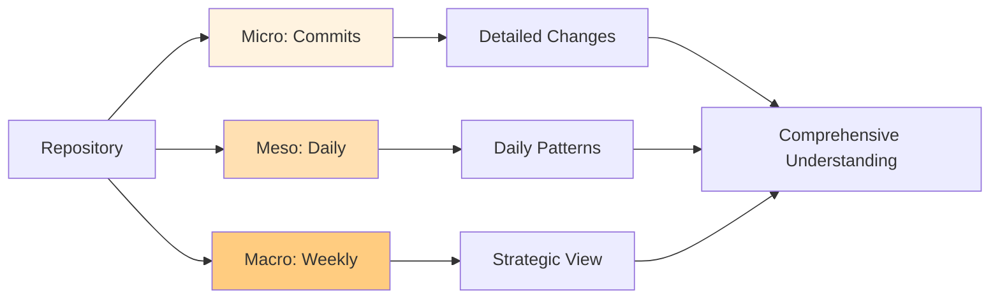
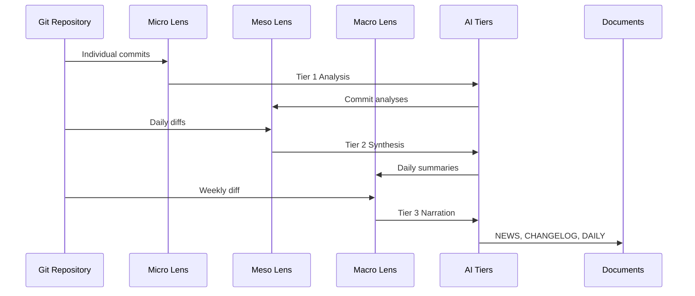

# Multi-Lens Analysis Strategy

Git AI Reporter analyzes repositories through three complementary lenses to build a complete understanding of development activity.

## Overview

The multi-lens approach examines changes at different granularities:

1. **Micro Lens**: Individual commit analysis
2. **Meso Lens**: Daily consolidation
3. **Macro Lens**: Weekly overview



## Micro Lens: Commit-Level Analysis

### Purpose
Extract detailed information from individual commits with intelligent filtering.

### Implementation

```python
class MicroLensAnalyzer:
    """Analyzes individual commits for detailed changes."""
    
    def analyze_commit(self, commit):
        """Analyze a single commit."""
        # Skip trivial commits
        if self.is_trivial_commit(commit):
            return None
            
        # Extract commit information
        diff = self.get_commit_diff(commit)
        
        # Analyze changes
        analysis = {
            'sha': commit.hexsha,
            'author': commit.author.name,
            'date': commit.committed_datetime,
            'message': commit.message,
            'files_changed': self.get_changed_files(commit),
            'additions': commit.stats.total['insertions'],
            'deletions': commit.stats.total['deletions'],
            'diff_analysis': self.analyze_diff(diff)
        }
        
        return analysis
    
    def is_trivial_commit(self, commit):
        """Determine if commit should be filtered."""
        # Filter by prefix
        prefixes = ['chore:', 'docs:', 'style:', 'test:', 'ci:']
        if any(commit.message.startswith(p) for p in prefixes):
            return True
            
        # Filter by file patterns
        patterns = ['*.md', '*.lock', '*.log', '.gitignore']
        changed_files = self.get_changed_files(commit)
        if all(self.matches_pattern(f, patterns) for f in changed_files):
            return True
            
        # Filter by size
        if commit.stats.total['lines'] < 5:
            return True
            
        return False
```

### Filtering Strategy

#### Excluded Commit Types
- **Maintenance**: `chore:` prefixed commits
- **Documentation**: `docs:` prefixed commits
- **Formatting**: `style:` prefixed commits
- **Tests only**: `test:` prefixed commits
- **CI/CD**: `ci:` prefixed commits

#### Excluded File Patterns
- Markdown files: `*.md`
- Lock files: `*.lock`, `package-lock.json`, `yarn.lock`
- Log files: `*.log`
- Configuration: `.gitignore`, `.editorconfig`

#### Size Thresholds
- Minimum changes: 5 lines
- Maximum files: 1000 files per commit

### Data Extraction

For each commit, we extract:

```python
commit_data = {
    'metadata': {
        'sha': 'abc123...',
        'author': 'Jane Developer',
        'email': 'jane@example.com',
        'date': '2025-01-24T10:30:00Z',
        'message': 'feat: Add user authentication'
    },
    'changes': {
        'files': ['auth.py', 'models.py'],
        'additions': 150,
        'deletions': 20,
        'net_change': 130
    },
    'analysis': {
        'type': 'feature',
        'impact': 'high',
        'components': ['authentication', 'user_management'],
        'technical_debt': 'reduced'
    }
}
```

## Meso Lens: Daily Consolidation

### Purpose
Aggregate daily activity to identify patterns and net progress.

### Implementation

```python
class MesoLensAnalyzer:
    """Consolidates commits into daily summaries."""
    
    def analyze_day(self, date, commits):
        """Analyze all commits for a given day."""
        # Group commits by hour
        hourly_activity = self.group_by_hour(commits)
        
        # Calculate net changes for the day
        start_sha = self.get_day_start_sha(date)
        end_sha = self.get_day_end_sha(date)
        daily_diff = self.calculate_diff(start_sha, end_sha)
        
        # Identify patterns
        patterns = self.identify_patterns(commits)
        
        # Generate summary
        summary = {
            'date': date,
            'commit_count': len(commits),
            'authors': self.get_unique_authors(commits),
            'net_changes': self.analyze_diff(daily_diff),
            'patterns': patterns,
            'peak_hours': self.find_peak_activity(hourly_activity),
            'focus_areas': self.identify_focus_areas(commits)
        }
        
        return summary
    
    def identify_patterns(self, commits):
        """Identify development patterns."""
        patterns = []
        
        # Feature development pattern
        feature_commits = [c for c in commits if 'feat' in c.message.lower()]
        if len(feature_commits) > len(commits) * 0.4:
            patterns.append('feature_development')
        
        # Bug fixing pattern
        fix_commits = [c for c in commits if 'fix' in c.message.lower()]
        if len(fix_commits) > len(commits) * 0.3:
            patterns.append('bug_fixing')
        
        # Refactoring pattern
        refactor_commits = [c for c in commits if 'refactor' in c.message.lower()]
        if len(refactor_commits) > len(commits) * 0.2:
            patterns.append('refactoring')
        
        return patterns
```

### Daily Metrics

#### Activity Metrics
- Total commits
- Unique contributors
- Peak activity hours
- Files modified
- Lines changed

#### Pattern Detection
- **Feature Sprint**: >40% feature commits
- **Bug Bash**: >30% fix commits
- **Refactoring Day**: >20% refactor commits
- **Documentation Push**: >30% docs updates
- **Integration Work**: >50% merge commits

### Net Change Calculation

Instead of summing individual commit diffs (which can be misleading due to reverts and amendments), we calculate the actual net change:

```python
def calculate_net_change(self, date):
    """Calculate actual net changes for the day."""
    # Get last commit of previous day
    yesterday = date - timedelta(days=1)
    start_commit = self.get_last_commit_of_day(yesterday)
    
    # Get last commit of current day
    end_commit = self.get_last_commit_of_day(date)
    
    # Calculate diff between these points
    if start_commit and end_commit:
        diff = self.repo.git.diff(
            start_commit.hexsha,
            end_commit.hexsha,
            numstat=True
        )
        return self.parse_diff_stats(diff)
    
    return None
```

## Macro Lens: Weekly Overview

### Purpose
Provide strategic, big-picture understanding of development progress.

### Implementation

```python
class MacroLensAnalyzer:
    """Analyzes weekly development patterns."""
    
    def analyze_week(self, start_date, end_date):
        """Analyze repository changes over a week."""
        # Get complete diff for the week
        start_sha = self.get_commit_at_date(start_date)
        end_sha = self.get_commit_at_date(end_date)
        weekly_diff = self.calculate_diff(start_sha, end_sha)
        
        # Aggregate daily summaries
        daily_summaries = self.get_daily_summaries(start_date, end_date)
        
        # Calculate trends
        trends = self.calculate_trends(daily_summaries)
        
        # Identify major achievements
        achievements = self.identify_achievements(weekly_diff, daily_summaries)
        
        return {
            'period': {
                'start': start_date,
                'end': end_date,
                'days_active': len(daily_summaries)
            },
            'overview': {
                'total_commits': sum(d['commit_count'] for d in daily_summaries),
                'unique_contributors': self.get_all_contributors(daily_summaries),
                'net_changes': self.analyze_diff(weekly_diff)
            },
            'trends': trends,
            'achievements': achievements,
            'focus_distribution': self.calculate_focus_distribution(daily_summaries)
        }
    
    def calculate_trends(self, daily_summaries):
        """Identify development trends."""
        trends = {
            'velocity': self.calculate_velocity_trend(daily_summaries),
            'quality': self.calculate_quality_trend(daily_summaries),
            'collaboration': self.calculate_collaboration_trend(daily_summaries),
            'focus': self.calculate_focus_trend(daily_summaries)
        }
        return trends
```

### Strategic Insights

#### Velocity Metrics
- Commit frequency trend
- Code change velocity
- Feature completion rate
- Bug resolution speed

#### Quality Indicators
- Test coverage changes
- Documentation updates
- Code review activity
- Technical debt management

#### Collaboration Patterns
- Team participation
- Cross-functional work
- Knowledge sharing
- Pair programming indicators

### Complete Context Generation

The macro lens provides full context for narrative generation:

```python
def generate_complete_context(self):
    """Generate comprehensive context for narrative."""
    context = {
        'repository': {
            'name': self.repo.name,
            'description': self.get_repo_description(),
            'primary_language': self.detect_primary_language(),
            'team_size': len(self.get_all_contributors())
        },
        'period_summary': {
            'dates': self.get_period_dates(),
            'working_days': self.count_working_days(),
            'total_commits': self.count_total_commits(),
            'active_branches': self.get_active_branches()
        },
        'technical_changes': {
            'features_added': self.extract_features(),
            'bugs_fixed': self.extract_bug_fixes(),
            'performance_improvements': self.extract_performance_improvements(),
            'breaking_changes': self.detect_breaking_changes()
        },
        'team_dynamics': {
            'contributors': self.analyze_contributor_activity(),
            'collaboration_graph': self.build_collaboration_graph(),
            'knowledge_areas': self.map_expertise_areas()
        }
    }
    return context
```

## Integration of Lenses

### Data Flow



### Complementary Insights

Each lens provides unique value:

| Lens | Granularity | Use Case | AI Tier |
|------|-------------|----------|---------|
| Micro | Individual commits | Detailed technical changes | Tier 1 |
| Meso | Daily aggregation | Pattern recognition | Tier 2 |
| Macro | Weekly overview | Strategic narrative | Tier 3 |

### Example Analysis

Given a week of development:

**Micro Lens** reveals:
- 127 individual commits
- 89 feature additions
- 38 bug fixes
- Filtered out 43 trivial commits

**Meso Lens** shows:
- Monday: Feature sprint (25 commits)
- Tuesday: Bug fixing day (18 commits)
- Wednesday: Refactoring focus (20 commits)
- Thursday: Integration work (15 commits)
- Friday: Documentation and cleanup (12 commits)

**Macro Lens** provides:
- Overall: Major authentication system overhaul
- Trend: Increasing velocity mid-week
- Achievement: 50% reduction in authentication bugs
- Context: Preparing for v2.0 release

## Benefits of Multi-Lens Approach

### Comprehensive Understanding
- No important changes missed
- Context preserved at all levels
- Patterns emerge from multiple perspectives

### Efficient Processing
- Appropriate analysis depth for each level
- Optimized AI model usage
- Intelligent caching strategies

### Flexible Reporting
- Technical details from micro lens
- Daily progress from meso lens
- Executive summary from macro lens

## Configuration

### Lens Parameters

```yaml
analysis:
  micro_lens:
    enabled: true
    filter_trivial: true
    min_change_size: 5
    max_files_per_commit: 1000
  
  meso_lens:
    enabled: true
    group_by_hours: true
    calculate_net_changes: true
    identify_patterns: true
  
  macro_lens:
    enabled: true
    include_trends: true
    include_achievements: true
    include_predictions: false
```

### Customization Options

```python
# Custom filtering for micro lens
config.micro_lens.custom_filters = [
    lambda c: 'WIP' not in c.message,
    lambda c: c.author.email.endswith('@company.com')
]

# Custom pattern detection for meso lens
config.meso_lens.custom_patterns = {
    'hotfix': lambda commits: any('hotfix' in c.message for c in commits),
    'release_prep': lambda commits: any('release' in c.message for c in commits)
}

# Custom metrics for macro lens
config.macro_lens.custom_metrics = {
    'test_coverage': calculate_test_coverage_change,
    'performance_score': calculate_performance_metrics
}
```

## Related Documentation

- [Three-Tier AI Architecture](three-tier-ai.md)
- [Caching Strategy](caching.md)
- [Configuration Guide](../guide/configuration.md)
- [Basic Usage](../guide/basic-usage.md)