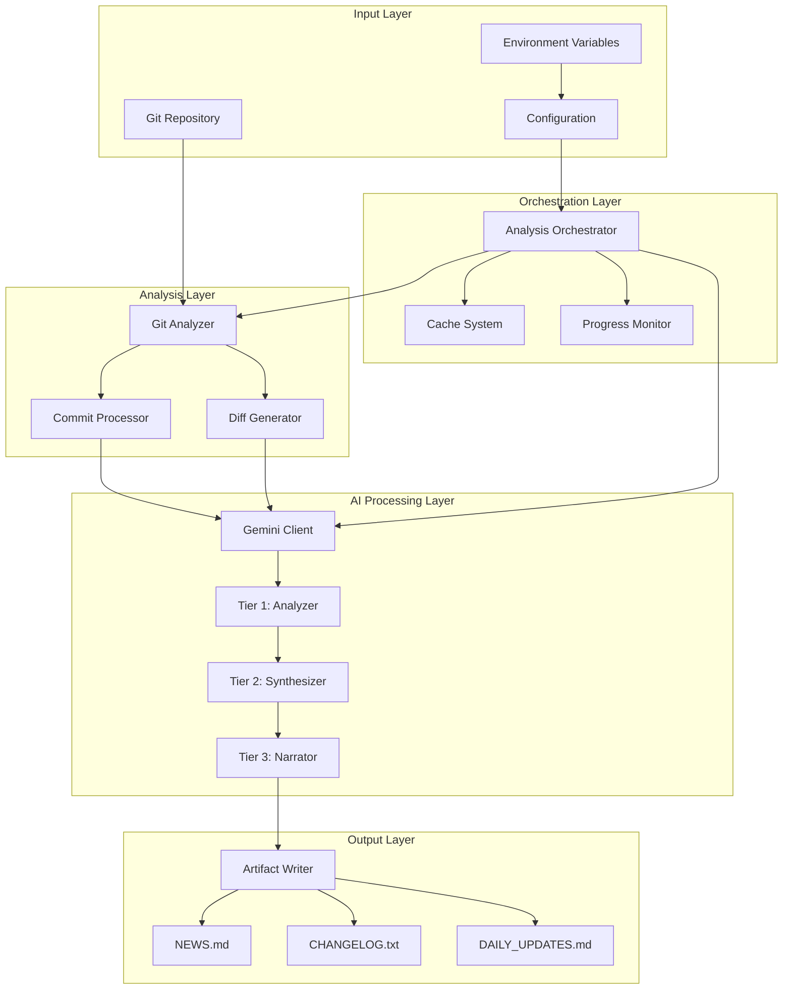

# Architecture Overview

Git AI Reporter follows a clean, modular architecture designed for maintainability, testability, and extensibility.

## System Architecture

## Key Architectural Principles

### 1. Clean Architecture

The system follows clean architecture principles with clear separation of concerns:

- **Domain Layer**: Core business logic and models (Pydantic)
- **Application Layer**: Use cases and orchestration
- **Infrastructure Layer**: External services and I/O
- **Presentation Layer**: CLI and output generation

### 2. Dependency Injection

All major components use dependency injection for:
- Testability with mock objects
- Configuration flexibility
- Loose coupling between components

### 3. Async-First Design

The entire pipeline is built on Python's asyncio for:
- Concurrent API calls to Gemini
- Parallel git operations
- Efficient I/O handling

## Component Overview

### Analysis Components

- **[GitAnalyzer](../api/analysis.md)**: Extracts and processes git history
- **Three-Lens Strategy**: Commit, daily, and weekly analysis views
- **Intelligent Filtering**: Removes noise from trivial commits

### AI Processing

- **[Three-Tier Architecture](three-tier-ai.md)**: Progressive AI refinement
- **[GeminiClient](../api/services.md)**: Manages AI interactions
- **Prompt Engineering**: Optimized prompts for each tier

### Orchestration

- **[AnalysisOrchestrator](../api/orchestration.md)**: Coordinates the entire pipeline
- **Progress Tracking**: Real-time status updates
- **Error Recovery**: Graceful handling of failures

### Output Generation

- **[ArtifactWriter](../api/writing.md)**: Generates final documents
- **Format Management**: Maintains document standards
- **Incremental Updates**: Merges new content with existing

## Data Flow

1. **Input Stage**: Repository analysis and configuration
2. **Processing Stage**: Three-lens git analysis
3. **AI Stage**: Three-tier progressive refinement
4. **Output Stage**: Document generation and formatting

## Performance Characteristics

- **Scalability**: Handles repositories with 10,000+ commits
- **Efficiency**: Intelligent caching reduces API calls by 60-80%
- **Speed**: Processes 1,000 commits in ~2-5 minutes
- **Reliability**: Retry logic and fallback mechanisms

## Extension Points

The architecture provides several extension points:

- **Custom Analyzers**: Extend `BaseAnalyzer` for new analysis types
- **AI Providers**: Swap Gemini for other LLM providers
- **Output Formats**: Add new document types
- **[Plugin System](plugins.md)**: Hook into the processing pipeline

## Security Considerations

- **API Key Management**: Secure storage in environment variables
- **Input Sanitization**: Protection against malicious git data
- **Rate Limiting**: Respects API quotas and limits
- **Data Privacy**: No sensitive data persisted unnecessarily

## See Also

- [Three-Tier AI Architecture](three-tier-ai.md)
- [Multi-Lens Analysis](multi-lens.md)
- [Caching System](caching.md)
- [JSON Handling](json-handling.md)
- [Plugin Architecture](plugins.md)