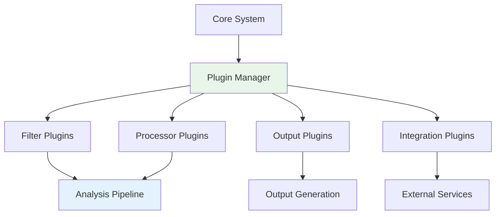

# Plugin Architecture

Git AI Reporter is designed with extensibility in mind, allowing custom plugins for analysis, processing, and output generation.

## Overview

The plugin system enables:
- Custom commit filters
- Additional AI processors
- New output formats
- External integrations
- Custom metrics and analytics



## Plugin System Architecture

### Plugin Base Classes

```python
from abc import ABC, abstractmethod
from typing import Any, Dict, List
from pydantic import BaseModel

class PluginMetadata(BaseModel):
    """Plugin metadata and configuration."""
    name: str
    version: str
    author: str
    description: str
    requires: List[str] = []
    config_schema: Dict[str, Any] = {}

class BasePlugin(ABC):
    """Base class for all plugins."""
    
    def __init__(self, config: Dict[str, Any]):
        self.config = config
        self.metadata = self.get_metadata()
        self.validate_config()
    
    @abstractmethod
    def get_metadata(self) -> PluginMetadata:
        """Return plugin metadata."""
        pass
    
    @abstractmethod
    def initialize(self) -> None:
        """Initialize plugin resources."""
        pass
    
    @abstractmethod
    def cleanup(self) -> None:
        """Cleanup plugin resources."""
        pass
    
    def validate_config(self) -> None:
        """Validate plugin configuration."""
        # Validate against config_schema
        pass
```

### Plugin Types

#### Filter Plugins

```python
class FilterPlugin(BasePlugin):
    """Plugin for filtering commits."""
    
    @abstractmethod
    def should_include(self, commit: Commit) -> bool:
        """Determine if commit should be processed."""
        pass
    
    @abstractmethod
    def filter_batch(self, commits: List[Commit]) -> List[Commit]:
        """Filter a batch of commits."""
        return [c for c in commits if self.should_include(c)]

# Example: Security-focused filter
class SecurityFilterPlugin(FilterPlugin):
    """Filter for security-related commits."""
    
    def get_metadata(self) -> PluginMetadata:
        return PluginMetadata(
            name="security_filter",
            version="1.0.0",
            author="Security Team",
            description="Filters security-related commits"
        )
    
    def should_include(self, commit: Commit) -> bool:
        """Include only security-related commits."""
        keywords = ['security', 'vulnerability', 'CVE', 'auth', 'encryption']
        message_lower = commit.message.lower()
        return any(keyword in message_lower for keyword in keywords)
```

#### Processor Plugins

```python
class ProcessorPlugin(BasePlugin):
    """Plugin for processing commit data."""
    
    @abstractmethod
    async def process(self, data: Any) -> Any:
        """Process data and return enhanced version."""
        pass
    
    @abstractmethod
    def get_priority(self) -> int:
        """Return processing priority (lower = higher priority)."""
        pass

# Example: Code metrics processor
class CodeMetricsPlugin(ProcessorPlugin):
    """Calculate code quality metrics."""
    
    def get_metadata(self) -> PluginMetadata:
        return PluginMetadata(
            name="code_metrics",
            version="1.0.0",
            author="Quality Team",
            description="Calculates code quality metrics"
        )
    
    async def process(self, commit_analysis: CommitAnalysis) -> CommitAnalysis:
        """Add code metrics to commit analysis."""
        metrics = await self.calculate_metrics(commit_analysis)
        commit_analysis.metrics = metrics
        return commit_analysis
    
    async def calculate_metrics(self, analysis):
        """Calculate various code metrics."""
        return {
            'complexity': self.calculate_complexity(analysis),
            'maintainability': self.calculate_maintainability(analysis),
            'test_coverage_delta': self.calculate_coverage_change(analysis)
        }
```

#### Output Plugins

```python
class OutputPlugin(BasePlugin):
    """Plugin for generating output formats."""
    
    @abstractmethod
    def generate(self, data: Dict[str, Any]) -> str:
        """Generate output from processed data."""
        pass
    
    @abstractmethod
    def get_file_extension(self) -> str:
        """Return file extension for output."""
        pass
    
    @abstractmethod
    def get_mime_type(self) -> str:
        """Return MIME type for output."""
        pass

# Example: JSON output plugin
class JSONOutputPlugin(OutputPlugin):
    """Generate JSON output."""
    
    def get_metadata(self) -> PluginMetadata:
        return PluginMetadata(
            name="json_output",
            version="1.0.0",
            author="Core Team",
            description="Generates JSON output"
        )
    
    def generate(self, data: Dict[str, Any]) -> str:
        """Generate formatted JSON."""
        return json.dumps(data, indent=2, default=str)
    
    def get_file_extension(self) -> str:
        return ".json"
    
    def get_mime_type(self) -> str:
        return "application/json"
```

#### Integration Plugins

```python
class IntegrationPlugin(BasePlugin):
    """Plugin for external service integration."""
    
    @abstractmethod
    async def send(self, data: Any) -> bool:
        """Send data to external service."""
        pass
    
    @abstractmethod
    def validate_connection(self) -> bool:
        """Validate connection to external service."""
        pass

# Example: Slack integration
class SlackIntegrationPlugin(IntegrationPlugin):
    """Send notifications to Slack."""
    
    def get_metadata(self) -> PluginMetadata:
        return PluginMetadata(
            name="slack_integration",
            version="1.0.0",
            author="DevOps Team",
            description="Sends reports to Slack",
            config_schema={
                "webhook_url": {"type": "string", "required": True},
                "channel": {"type": "string", "default": "#dev"}
            }
        )
    
    async def send(self, report: str) -> bool:
        """Send report to Slack channel."""
        webhook_url = self.config['webhook_url']
        payload = {
            'text': f"📊 Development Report",
            'blocks': self.format_report(report)
        }
        
        async with httpx.AsyncClient() as client:
            response = await client.post(webhook_url, json=payload)
            return response.status_code == 200
```

## Plugin Manager

### Plugin Discovery and Loading

```python
class PluginManager:
    """Manages plugin lifecycle and execution."""
    
    def __init__(self, plugin_dir: Path):
        self.plugin_dir = plugin_dir
        self.plugins: Dict[str, BasePlugin] = {}
        self.hooks: Dict[str, List[BasePlugin]] = {}
    
    def discover_plugins(self) -> None:
        """Discover and load plugins from directory."""
        for plugin_file in self.plugin_dir.glob("*.py"):
            if plugin_file.stem.startswith("_"):
                continue
                
            module = self.load_module(plugin_file)
            for item_name in dir(module):
                item = getattr(module, item_name)
                if self.is_plugin_class(item):
                    self.register_plugin(item)
    
    def load_module(self, path: Path):
        """Dynamically load Python module."""
        spec = importlib.util.spec_from_file_location(
            path.stem, path
        )
        module = importlib.util.module_from_spec(spec)
        spec.loader.exec_module(module)
        return module
    
    def register_plugin(self, plugin_class: Type[BasePlugin]) -> None:
        """Register a plugin class."""
        plugin = plugin_class(self.get_plugin_config(plugin_class))
        plugin.initialize()
        
        metadata = plugin.get_metadata()
        self.plugins[metadata.name] = plugin
        
        # Register hooks
        self.register_hooks(plugin)
```

### Hook System

```python
class HookManager:
    """Manages plugin hooks and execution points."""
    
    HOOK_POINTS = [
        'pre_analysis',
        'post_commit_analysis',
        'pre_synthesis',
        'post_synthesis',
        'pre_narrative',
        'post_narrative',
        'pre_output',
        'post_output'
    ]
    
    def __init__(self):
        self.hooks = {hook: [] for hook in self.HOOK_POINTS}
    
    def register(self, hook_point: str, plugin: BasePlugin, priority: int = 50):
        """Register plugin for hook point."""
        if hook_point not in self.HOOK_POINTS:
            raise ValueError(f"Invalid hook point: {hook_point}")
        
        self.hooks[hook_point].append((priority, plugin))
        self.hooks[hook_point].sort(key=lambda x: x[0])
    
    async def execute(self, hook_point: str, data: Any) -> Any:
        """Execute all plugins for hook point."""
        for priority, plugin in self.hooks[hook_point]:
            try:
                data = await plugin.process(data)
            except Exception as e:
                logger.error(f"Plugin {plugin.metadata.name} failed: {e}")
                if plugin.metadata.get('required', False):
                    raise
        return data
```

## Plugin Development

### Creating a Custom Plugin

1. **Define Plugin Class**

```python
# my_plugin.py
from git_ai_reporter.plugins import ProcessorPlugin, PluginMetadata

class MyCustomPlugin(ProcessorPlugin):
    """Custom plugin for enhanced analysis."""
    
    def get_metadata(self) -> PluginMetadata:
        return PluginMetadata(
            name="my_custom_plugin",
            version="1.0.0",
            author="Your Name",
            description="Adds custom analysis",
            requires=["numpy", "pandas"],
            config_schema={
                "threshold": {
                    "type": "number",
                    "default": 0.8,
                    "description": "Analysis threshold"
                }
            }
        )
    
    def initialize(self):
        """Initialize plugin resources."""
        import numpy as np
        import pandas as pd
        self.np = np
        self.pd = pd
    
    async def process(self, data):
        """Process data with custom logic."""
        # Your custom processing logic
        threshold = self.config.get('threshold', 0.8)
        # ... processing ...
        return enhanced_data
    
    def cleanup(self):
        """Cleanup resources."""
        pass
```

2. **Configure Plugin**

```yaml
# .git-ai-reporter.yml
plugins:
  enabled: true
  directory: plugins/
  
  configurations:
    my_custom_plugin:
      threshold: 0.9
      enabled: true
```

3. **Install Plugin**

```bash
# Place plugin in plugins directory
cp my_plugin.py plugins/

# Install dependencies
pip install numpy pandas

# Run with plugins
git-ai-reporter --enable-plugins
```

### Plugin Best Practices

#### Error Handling

```python
class RobustPlugin(BasePlugin):
    """Plugin with robust error handling."""
    
    async def process(self, data):
        """Process with error handling."""
        try:
            return await self._process_internal(data)
        except Exception as e:
            logger.error(f"Plugin error: {e}")
            
            # Graceful degradation
            if self.config.get('fail_soft', True):
                return data  # Return unmodified
            else:
                raise  # Propagate error
```

#### Performance Optimization

```python
class OptimizedPlugin(BasePlugin):
    """Performance-optimized plugin."""
    
    def __init__(self, config):
        super().__init__(config)
        self.cache = {}
        self.batch_size = config.get('batch_size', 100)
    
    async def process_batch(self, items):
        """Process items in batches."""
        results = []
        for i in range(0, len(items), self.batch_size):
            batch = items[i:i + self.batch_size]
            batch_results = await self._process_batch_internal(batch)
            results.extend(batch_results)
        return results
```

#### Testing Plugins

```python
import pytest
from git_ai_reporter.plugins import PluginManager

@pytest.fixture
def plugin_manager():
    """Create plugin manager for testing."""
    manager = PluginManager(plugin_dir=Path("test_plugins"))
    return manager

def test_plugin_loading(plugin_manager):
    """Test plugin discovery and loading."""
    plugin_manager.discover_plugins()
    assert "my_custom_plugin" in plugin_manager.plugins

def test_plugin_processing():
    """Test plugin processing."""
    plugin = MyCustomPlugin({"threshold": 0.5})
    result = asyncio.run(plugin.process(test_data))
    assert result.enhanced == True
```

## Built-in Plugins

### Security Scanner Plugin

```python
class SecurityScannerPlugin(ProcessorPlugin):
    """Scan for security vulnerabilities."""
    
    VULNERABILITY_PATTERNS = [
        r'password\s*=\s*["\'].*["\']',
        r'api[_-]?key\s*=\s*["\'].*["\']',
        r'token\s*=\s*["\'].*["\']'
    ]
    
    async def process(self, commit_analysis):
        """Scan for security issues."""
        vulnerabilities = []
        
        for pattern in self.VULNERABILITY_PATTERNS:
            if re.search(pattern, commit_analysis.diff, re.IGNORECASE):
                vulnerabilities.append({
                    'type': 'credential_exposure',
                    'pattern': pattern,
                    'severity': 'high'
                })
        
        if vulnerabilities:
            commit_analysis.security_issues = vulnerabilities
            commit_analysis.requires_review = True
        
        return commit_analysis
```

### Performance Metrics Plugin

```python
class PerformanceMetricsPlugin(ProcessorPlugin):
    """Calculate performance metrics."""
    
    async def process(self, weekly_summary):
        """Add performance metrics."""
        metrics = {
            'velocity': self.calculate_velocity(weekly_summary),
            'efficiency': self.calculate_efficiency(weekly_summary),
            'quality_score': self.calculate_quality(weekly_summary)
        }
        
        weekly_summary.performance_metrics = metrics
        return weekly_summary
```

### Template Engine Plugin

```python
class TemplateEnginePlugin(OutputPlugin):
    """Custom template-based output generation."""
    
    def __init__(self, config):
        super().__init__(config)
        self.env = Environment(
            loader=FileSystemLoader(config['template_dir'])
        )
    
    def generate(self, data):
        """Generate output using Jinja2 template."""
        template_name = self.config['template']
        template = self.env.get_template(template_name)
        return template.render(**data)
```

## Plugin Configuration

### Global Plugin Settings

```yaml
plugins:
  enabled: true
  directory: plugins/
  auto_discover: true
  fail_on_error: false
  
  # Plugin execution
  parallel_execution: true
  max_workers: 4
  timeout: 30
  
  # Plugin management
  auto_update: false
  verify_signatures: true
  allowed_authors: ["trusted_team"]
```

### Per-Plugin Configuration

```yaml
plugins:
  configurations:
    security_scanner:
      enabled: true
      severity_threshold: "medium"
      scan_patterns:
        - "password"
        - "secret"
        - "token"
    
    slack_integration:
      enabled: false
      webhook_url: "${SLACK_WEBHOOK_URL}"
      channel: "#dev-reports"
      notify_on: ["weekly", "release"]
    
    custom_metrics:
      enabled: true
      metrics:
        - "complexity"
        - "coverage"
        - "performance"
```

## Plugin Marketplace

### Publishing Plugins

```python
# plugin_metadata.json
{
    "name": "my-awesome-plugin",
    "version": "1.0.0",
    "description": "Awesome functionality",
    "author": "Your Name",
    "license": "MIT",
    "homepage": "https://github.com/user/plugin",
    "requirements": [
        "numpy>=1.20.0",
        "pandas>=1.3.0"
    ],
    "compatibility": {
        "git-ai-reporter": ">=0.1.0"
    }
}
```

### Installing from Marketplace

```bash
# Install plugin from marketplace
git-ai-reporter plugin install security-scanner

# List available plugins
git-ai-reporter plugin search

# Update plugins
git-ai-reporter plugin update --all

# Remove plugin
git-ai-reporter plugin remove security-scanner
```

## Related Documentation

- [Architecture Overview](index.md)
- [Configuration Guide](../guide/configuration.md)
- [API Reference](../api/index.md)
- [Development Guide](../development/index.md)