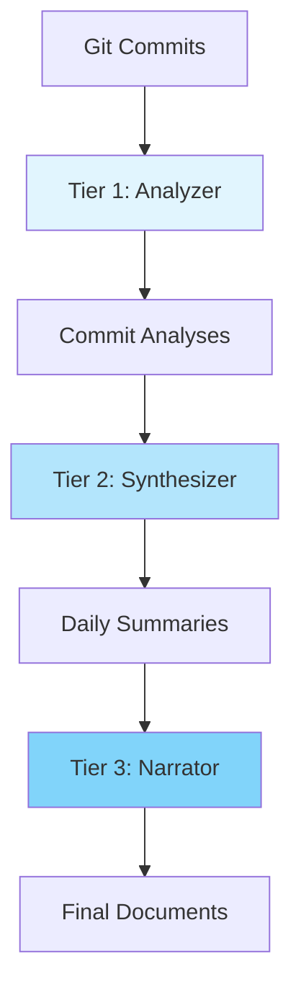

# Three-Tier AI Architecture

Git AI Reporter uses a sophisticated three-tier AI architecture that optimizes for both cost and quality.

## Overview

The three-tier system processes repository data through increasingly sophisticated AI models, each optimized for specific tasks:



## Tier 1: Analyzer (gemini-2.5-flash)

### Purpose
High-volume, fast commit analysis with intelligent filtering.

### Characteristics
- **Model**: Gemini 2.5 Flash
- **Speed**: Fast processing
- **Token Usage**: Optimized for volume
- **Cost**: Lower cost tier

### Processing Logic

```python
class Tier1Analyzer:
    """Processes individual commits for key information."""
    
    def analyze_commit(self, commit):
        # Extract commit metadata
        metadata = {
            'sha': commit.hexsha,
            'author': commit.author.name,
            'date': commit.committed_datetime,
            'message': commit.message
        }
        
        # Generate diff
        diff = self.get_commit_diff(commit)
        
        # Filter noise
        if self.is_trivial(commit):
            return None
            
        # AI analysis
        analysis = self.gemini_flash.analyze(
            prompt=self.build_commit_prompt(metadata, diff),
            max_tokens=1000,
            temperature=0.3
        )
        
        return CommitAnalysis(
            metadata=metadata,
            changes=analysis.changes,
            impact=analysis.impact
        )
```

### Filtering Strategy

The analyzer filters out:
- Commits with prefixes: `chore:`, `docs:`, `style:`, `test:`, `ci:`
- Files matching patterns: `*.md`, `*.lock`, `*.log`, `.gitignore`
- Directories: `docs/`, `.github/`, `tests/`
- Commits with minimal changes (< 5 lines)

### Output Format

```json
{
  "commit_sha": "abc123",
  "summary": "Implemented user authentication system",
  "changes": [
    {
      "type": "feature",
      "description": "Added JWT token validation",
      "files": ["auth.py", "middleware.py"]
    }
  ],
  "technical_details": "Uses RS256 algorithm for token signing",
  "impact": "high",
  "category": "security"
}
```

## Tier 2: Synthesizer (gemini-2.5-pro)

### Purpose
Pattern recognition and daily consolidation of commit analyses.

### Characteristics
- **Model**: Gemini 2.5 Pro
- **Speed**: Balanced processing
- **Token Usage**: Moderate usage
- **Cost**: Higher quality tier

### Processing Logic

```python
class Tier2Synthesizer:
    """Consolidates daily commits into coherent summaries."""
    
    def synthesize_day(self, date, commit_analyses):
        # Group by feature/area
        grouped = self.group_by_feature(commit_analyses)
        
        # Calculate daily diff
        daily_diff = self.calculate_net_changes(date)
        
        # Identify patterns
        patterns = self.identify_patterns(grouped)
        
        # AI synthesis
        synthesis = self.gemini_pro.synthesize(
            prompt=self.build_daily_prompt(
                analyses=commit_analyses,
                diff=daily_diff,
                patterns=patterns
            ),
            max_tokens=5000,
            temperature=0.5
        )
        
        return DailySummary(
            date=date,
            highlights=synthesis.highlights,
            technical_progress=synthesis.technical,
            statistics=self.calculate_stats(commit_analyses)
        )
```

### Pattern Recognition

The synthesizer identifies:
- **Feature clusters**: Related commits working on the same feature
- **Bug fix patterns**: Series of fixes addressing related issues
- **Refactoring efforts**: Systematic code improvements
- **Performance optimizations**: Speed and efficiency improvements
- **Security enhancements**: Security-related changes

### Daily Consolidation

For each 24-hour period:
1. Groups commits by timestamp
2. Calculates net diff between day start and end
3. Identifies overarching themes
4. Generates cohesive daily narrative

## Tier 3: Narrator (gemini-2.5-pro)

### Purpose
Final document generation with audience-aware narratives.

### Characteristics
- **Model**: Gemini 2.5 Pro
- **Speed**: Quality-focused processing
- **Token Usage**: Comprehensive analysis
- **Cost**: Higher quality tier

### Processing Logic

```python
class Tier3Narrator:
    """Creates polished, audience-aware documentation."""
    
    def generate_narrative(self, weekly_data):
        # Aggregate all information
        context = {
            'daily_summaries': weekly_data.daily_summaries,
            'weekly_diff': self.calculate_weekly_diff(),
            'statistics': weekly_data.statistics,
            'repository_info': self.get_repo_metadata()
        }
        
        # Generate NEWS.md
        news = self.gemini_pro.generate(
            prompt=self.build_news_prompt(context),
            max_tokens=8000,
            temperature=0.7,
            style="executive_summary"
        )
        
        # Generate CHANGELOG.txt
        changelog = self.gemini_pro.generate(
            prompt=self.build_changelog_prompt(context),
            max_tokens=8000,
            temperature=0.3,
            style="technical_structured"
        )
        
        return {
            'news': news,
            'changelog': changelog,
            'daily_updates': self.format_daily_updates(context)
        }
```

### Document Generation Strategy

#### NEWS.md
- **Audience**: Stakeholders, non-technical readers
- **Style**: Narrative, story-driven
- **Focus**: Business impact, major achievements
- **Tone**: Professional, accessible

#### CHANGELOG.txt
- **Audience**: Developers, technical users
- **Style**: Structured, categorical
- **Focus**: Technical changes, API modifications
- **Format**: Keep a Changelog standard

#### DAILY_UPDATES.md
- **Audience**: Team members, project managers
- **Style**: Chronological, detailed
- **Focus**: Day-by-day progress
- **Format**: Markdown with statistics

## Cost Optimization

### Token Usage

The three-tier system optimizes token usage by:
- Using the fast, cheaper model for high-volume commit analysis
- Using the higher-quality model for synthesis and narrative generation
- Caching results to avoid redundant API calls

### Optimization Strategies

1. **Intelligent Caching**
   - Cache Tier 1 analyses (30-day TTL)
   - Cache Tier 2 summaries (7-day TTL)
   - Skip re-analysis of unchanged commits

2. **Model Selection**
   - Use Flash for high-volume operations
   - Reserve Pro for quality-critical tasks
   - Allow configuration overrides

3. **Batch Processing**
   - Process commits in batches of 50
   - Combine related API calls
   - Use async operations

## Quality Assurance

### Validation Checks

Each tier includes validation:

```python
def validate_tier1_output(analysis):
    """Validate Tier 1 analysis output."""
    assert analysis.summary, "Summary required"
    assert len(analysis.summary) > 10, "Summary too short"
    assert analysis.changes, "Changes required"
    assert analysis.category in VALID_CATEGORIES
    return True

def validate_tier2_output(summary):
    """Validate Tier 2 synthesis output."""
    assert summary.date, "Date required"
    assert summary.highlights, "Highlights required"
    assert summary.statistics, "Statistics required"
    return True

def validate_tier3_output(documents):
    """Validate Tier 3 narrative output."""
    assert documents['news'], "NEWS.md required"
    assert documents['changelog'], "CHANGELOG.txt required"
    assert len(documents['news']) > 100, "News too short"
    return True
```

### Error Handling

```python
class TierProcessor:
    """Base class for tier processors with error handling."""
    
    async def process_with_retry(self, data, max_retries=3):
        """Process with exponential backoff retry."""
        for attempt in range(max_retries):
            try:
                result = await self.process(data)
                self.validate(result)
                return result
            except (APIError, ValidationError) as e:
                if attempt == max_retries - 1:
                    return self.fallback_processing(data)
                await asyncio.sleep(2 ** attempt)
```

## Configuration

### Model Selection

```yaml
ai:
  tier1_model: gemini-2.5-flash  # Fast, cheap
  tier2_model: gemini-2.5-pro    # Balanced
  tier3_model: gemini-2.5-pro    # Quality

  # Override for quality
  quality_mode:
    tier1_model: gemini-2.5-pro
    tier2_model: gemini-2.5-pro
    tier3_model: gemini-2.5-pro

  # Override for speed
  speed_mode:
    tier1_model: gemini-2.5-flash
    tier2_model: gemini-2.5-flash
    tier3_model: gemini-2.5-flash
```

### Processing Parameters

```yaml
processing:
  tier1:
    max_tokens: 1000
    temperature: 0.3
    batch_size: 50
  
  tier2:
    max_tokens: 5000
    temperature: 0.5
    batch_size: 7
  
  tier3:
    max_tokens: 10000
    temperature: 0.7
    batch_size: 1
```

## Future Enhancements

### Planned Improvements

1. **Tier 4: Executive Briefing**
   - Ultra-concise summaries for C-level executives
   - Monthly/quarterly roll-ups
   - Strategic insights

2. **Adaptive Model Selection**
   - Automatic model selection based on repository size
   - Dynamic quality/cost optimization
   - Load balancing across models

3. **Multi-Provider Support**
   - OpenAI GPT-4 integration
   - Additional AI provider support
   - Local model options

4. **Real-time Processing**
   - Webhook-triggered analysis
   - Incremental updates
   - Live dashboards

## Related Documentation

- [Multi-Lens Analysis](multi-lens.md)
- [Caching Strategy](caching.md)
- [Performance Optimization](../guide/performance.md)
- [Configuration Guide](../guide/configuration.md)