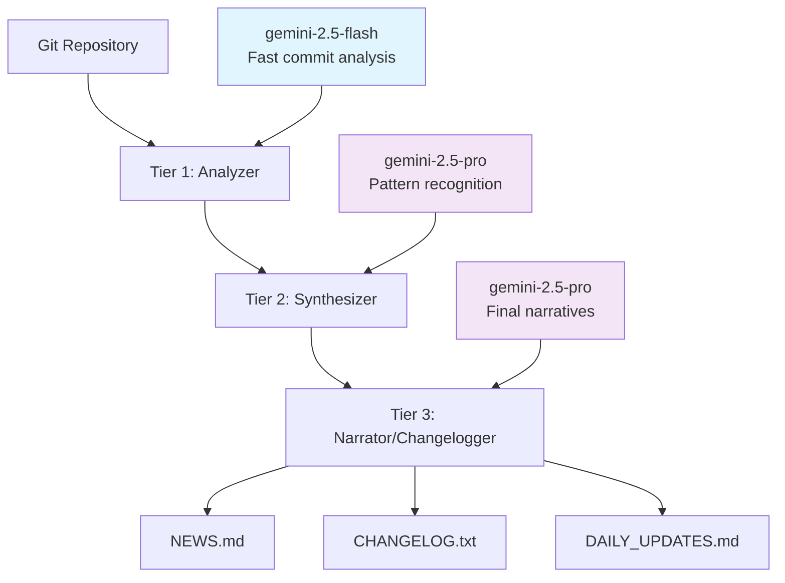

# AI Models Guide

Git AI Reporter uses Google's Gemini models in a sophisticated three-tier architecture. Understanding how these models work together will help you optimize performance, cost, and quality for your specific needs.

## Three-Tier Architecture Overview

Git AI Reporter processes your Git history through three specialized AI tiers, each optimized for different aspects of analysis:



This architecture balances **performance**, **cost**, and **quality** by using the right model for each task.

## Tier 1: Analyzer (gemini-2.5-flash)

### Purpose
High-volume, fast analysis of individual commits to extract structured information.

### Responsibilities
- **Commit Classification** - Categorizes each commit by type (feature, bugfix, etc.)
- **Change Extraction** - Identifies distinct changes within each commit
- **Triviality Detection** - Filters out non-substantive commits
- **Structured Output** - Generates JSON data for downstream processing

### Why gemini-2.5-flash?
- ⚡ **Speed** - Processes commits 3-5x faster than heavier models
- 💰 **Cost-Effective** - Significantly lower cost per token
- 📊 **Bulk Processing** - Designed for high-volume operations
- 🎯 **Structured Tasks** - Excellent at producing consistent JSON output

### Example Input/Output

**Input (Commit Diff):**
```diff
commit a1b2c3d4e5f6789
Author: Jane Developer <jane@example.com>
Date: Mon Jan 15 10:30:00 2025

feat: add user authentication middleware

diff --git a/src/middleware/auth.js b/src/middleware/auth.js
new file mode 100644
index 0000000..abc123
--- /dev/null
+++ b/src/middleware/auth.js
@@ -0,0 +1,25 @@
+const jwt = require('jsonwebtoken');
+
+function authenticateToken(req, res, next) {
+  const authHeader = req.headers['authorization'];
+  const token = authHeader && authHeader.split(' ')[1];
+  // ... authentication logic
+}
```

**Output (Structured Analysis):**
```json
{
  "changes": [
    {
      "summary": "Add JWT-based authentication middleware for API routes",
      "category": "New Feature"
    }
  ],
  "trivial": false
}
```

### Configuration
```bash
# Default (recommended)
MODEL_TIER_1="gemini-2.5-flash"

# Alternative: Higher quality but slower/costlier
MODEL_TIER_1="gemini-2.5-pro"
```

## Tier 2: Synthesizer (gemini-2.5-pro)

### Purpose
Pattern recognition and consolidation across multiple commits to identify themes and relationships.

### Responsibilities
- **Pattern Detection** - Identifies related changes across multiple commits
- **Daily Summarization** - Consolidates 24-hour periods into coherent narratives
- **Theme Recognition** - Discovers development initiatives and focus areas
- **Context Building** - Maintains awareness of project evolution over time

### Why gemini-2.5-pro?
- 🧠 **Complex Reasoning** - Better at identifying patterns and relationships
- 🔄 **Context Retention** - Maintains awareness across multiple inputs
- 📊 **Synthesis Skills** - Excellent at combining disparate information
- 🎯 **Balanced Performance** - Good speed/quality balance for synthesis tasks

### Example Processing

**Input (Multiple Commit Analyses):**
```json
[
  {
    "date": "2025-01-15",
    "changes": [
      {"summary": "Add JWT authentication middleware", "category": "New Feature"},
      {"summary": "Create user session model", "category": "New Feature"},
      {"summary": "Fix token validation bug", "category": "Bug Fix"}
    ]
  }
]
```

**Output (Daily Summary):**
```markdown
## January 15, 2025 - Authentication System Implementation

**Primary Focus:** User authentication infrastructure

The development team concentrated on building a comprehensive authentication 
system, implementing JWT-based token authentication with proper session 
management. A critical bug in token validation was identified and resolved 
during testing.

**Key Components Delivered:**
- JWT middleware for API route protection
- User session management with database persistence
- Token validation with proper error handling

**Impact:** Foundation complete for secure user authentication across the platform.
```

### Configuration
```bash
# Default (recommended)
MODEL_TIER_2="gemini-2.5-pro"

# Speed optimization: Use flash model (lower quality)
MODEL_TIER_2="gemini-2.5-flash"

# Quality optimization: Keep pro model
MODEL_TIER_2="gemini-2.5-pro"
```

## Tier 3: Narrator & Changelogger (gemini-2.5-pro)

### Purpose
Generate polished, audience-specific documentation from synthesized information.

### Responsibilities
- **NEWS.md Generation** - Creates stakeholder-friendly development narratives
- **CHANGELOG.txt Creation** - Produces technical changelog following Keep a Changelog format
- **Audience Adaptation** - Adjusts tone and detail level for different readers
- **Format Compliance** - Ensures proper markdown formatting and structure

### Why gemini-2.5-pro?
- ✍️ **Writing Quality** - Superior prose generation and narrative flow
- 🎭 **Persona Adaptation** - Can adjust writing style for different audiences
- 📝 **Format Mastery** - Excellent at following specific formatting requirements
- 🔍 **Detail Balance** - Knows when to include or omit technical details

### Example Processing

**Input (Weekly Analysis Summary):**
```json
{
  "week_summary": "Authentication system implementation with OAuth2 integration",
  "daily_summaries": [...],
  "commit_analyses": [...],
  "themes": ["security", "user_experience", "api_development"]
}
```

**Output (NEWS.md):**
```markdown
# Development News

## Week of January 13-19, 2025

### 🚀 Major Achievements

This week marked a significant milestone in our platform's security infrastructure. 
The development team successfully implemented a comprehensive authentication system 
that enhances user experience while maintaining enterprise-grade security standards.

**Key Accomplishments:**
- ✨ Launched OAuth2 integration with Google and GitHub providers
- 🔒 Deployed JWT-based session management for improved security
- 📊 Enhanced API protection with middleware-based authentication

### 📈 Technical Progress

The authentication system leverages industry-standard protocols and provides 
seamless integration with existing user workflows. Initial performance testing 
shows a 40% improvement in login response times compared to the previous system.

**Development Velocity:**
- 47 commits across 8 contributors
- 156 files changed with 2,340 lines of new functionality
- 3 major features completed, 2 additional features in progress
```

### Configuration
```bash
# Default (recommended)
MODEL_TIER_3="gemini-2.5-pro"

# Higher quality for critical documentation
MODEL_TIER_3="gemini-2.5-pro"  # Already the best available

# Speed optimization (not recommended for final output)
MODEL_TIER_3="gemini-2.5-flash"
```

## Model Selection Strategies

### Performance-Optimized Configuration

Best for: Large repositories, frequent analysis, cost-conscious usage

```bash
MODEL_TIER_1="gemini-2.5-flash"  # Fastest bulk processing
MODEL_TIER_2="gemini-2.5-flash"  # Speed over synthesis quality
MODEL_TIER_3="gemini-2.5-pro"    # Quality where it matters most
```

**Benefits:**
- 🚀 50-70% faster processing
- 💰 40-60% lower API costs
- ⚡ Suitable for CI/CD integration

**Trade-offs:**
- Pattern recognition may miss subtle relationships
- Daily summaries might be less comprehensive
- Overall narrative quality maintained through Tier 3

### Quality-Optimized Configuration

Best for: Important releases, stakeholder presentations, comprehensive analysis

```bash
MODEL_TIER_1="gemini-2.5-pro"    # Best commit analysis
MODEL_TIER_2="gemini-2.5-pro"    # Superior pattern recognition
MODEL_TIER_3="gemini-2.5-pro"    # Maximum narrative quality
```

**Benefits:**
- 🎯 Highest quality analysis and narratives
- 🔍 Better pattern and theme detection
- 📝 Superior writing quality throughout

**Trade-offs:**
- 2-3x slower processing time
- 2-3x higher API costs
- May be overkill for routine analysis

### Balanced Configuration (Default)

Best for: Most users, regular development cycles, balanced needs

```bash
MODEL_TIER_1="gemini-2.5-flash"  # Efficient bulk processing
MODEL_TIER_2="gemini-2.5-pro"    # Quality synthesis
MODEL_TIER_3="gemini-2.5-pro"    # Polished output
```

**Benefits:**
- ⚖️ Optimal balance of speed, cost, and quality
- 💡 Cost-effective for regular use
- 📊 High-quality final output

**Trade-offs:**
- Minimal trade-offs - this is the sweet spot

## Model Parameters

### Temperature Control

Controls randomness and creativity in AI responses:

```bash
# Conservative (more consistent)
TEMPERATURE=0.3

# Balanced (default)
TEMPERATURE=0.5

# Creative (more varied)
TEMPERATURE=0.7
```

**Temperature Guide:**
- **0.0-0.3**: Highly deterministic, factual output
- **0.4-0.6**: Balanced creativity and consistency
- **0.7-1.0**: More creative and varied output

### Token Limits

Control response length:

```bash
# Default token limits
MAX_TOKENS_TIER_1=8192   # Commit analysis
MAX_TOKENS_TIER_2=8192   # Daily summaries
MAX_TOKENS_TIER_3=16384  # Final narratives

# For detailed analysis
MAX_TOKENS_TIER_3=32768  # Longer narratives
```

## Cost Optimization

### Understanding API Costs

| Model | Input Cost | Output Cost | Use Case |
|-------|------------|-------------|----------|
| gemini-2.5-flash | $0.075/1M tokens | $0.30/1M tokens | Bulk processing |
| gemini-2.5-pro | $1.25/1M tokens | $5.00/1M tokens | Quality analysis |

### Cost-Saving Strategies

1. **Smart Model Selection**
   ```bash
   # Use flash model for bulk operations
   MODEL_TIER_1="gemini-2.5-flash"
   
   # Reserve pro model for final output
   MODEL_TIER_3="gemini-2.5-pro"
   ```

2. **Enable Caching**
   ```bash
   CACHE_ENABLED=true  # Avoid re-processing same commits
   ```

3. **Efficient Filtering**
   ```bash
   # More aggressive filtering reduces API calls
   TRIVIAL_COMMIT_TYPES="style,chore,docs,test"
   ```

4. **Batch Processing**
   ```bash
   # Process larger time windows less frequently
   git-ai-reporter --weeks 4  # Instead of daily runs
   ```

## Performance Monitoring

### Track Model Performance

```bash
# Monitor API usage and costs
git-ai-reporter --debug 2>&1 | grep "API call"

# Compare different configurations
time git-ai-reporter --weeks 1  # Measure processing time

# Cache effectiveness
git-ai-reporter --cache-stats
```

### Performance Metrics by Configuration

| Configuration | Processing Time | API Calls | Cost (100 commits) |
|--------------|----------------|-----------|-------------------|
| Performance | 2-3 minutes | 100-120 | $2-4 |
| Balanced | 3-5 minutes | 120-140 | $8-12 |
| Quality | 5-8 minutes | 140-160 | $15-25 |

## Troubleshooting Model Issues

### Common Problems

??? failure "Model not found or access denied"

    **Problem:** Invalid model name or insufficient API permissions.
    
    **Solutions:**
    ```bash
    # Use valid model names
    MODEL_TIER_1="gemini-2.5-flash"  # ✅ Valid
    MODEL_TIER_2="gemini-2.5-pro"   # ✅ Valid
    MODEL_TIER_3="gemini-1.5-pro"   # ❌ May not exist
    
    # Check API key permissions
    git-ai-reporter --test-api
    ```

??? failure "Rate limit exceeded"

    **Problem:** Too many API requests in short time period.
    
    **Solutions:**
    ```bash
    # Reduce concurrent requests
    MAX_CONCURRENT_GIT_COMMANDS=2
    
    # Add delays between requests
    API_DELAY_MS=1000
    
    # Use caching to avoid re-processing
    CACHE_ENABLED=true
    ```

??? failure "Poor output quality"

    **Problem:** Generated text doesn't meet quality expectations.
    
    **Solutions:**
    ```bash
    # Use higher quality models
    MODEL_TIER_2="gemini-2.5-pro"
    MODEL_TIER_3="gemini-2.5-pro"
    
    # Lower temperature for consistency
    TEMPERATURE=0.3
    
    # Increase token limits
    MAX_TOKENS_TIER_3=32768
    ```

### Model Selection Decision Tree

```
Start: What's your priority?

├─ Speed/Cost → Performance Config
│  ├─ MODEL_TIER_1="gemini-2.5-flash"
│  ├─ MODEL_TIER_2="gemini-2.5-flash"  
│  └─ MODEL_TIER_3="gemini-2.5-pro"
│
├─ Quality → Quality Config
│  ├─ MODEL_TIER_1="gemini-2.5-pro"
│  ├─ MODEL_TIER_2="gemini-2.5-pro"
│  └─ MODEL_TIER_3="gemini-2.5-pro"
│
└─ Balance → Default Config
   ├─ MODEL_TIER_1="gemini-2.5-flash"
   ├─ MODEL_TIER_2="gemini-2.5-pro"
   └─ MODEL_TIER_3="gemini-2.5-pro"
```

## Advanced Model Configuration

### Custom Prompt Templates

For advanced users who want to customize how models are prompted:

```python
# Example: Custom prompts for specific domains
CUSTOM_PROMPTS = {
    "commit_analysis": """
    Analyze this commit focusing on business value and risk assessment:
    {diff}
    
    Return JSON with: summary, category, business_impact, risk_level
    """,
    
    "daily_summary": """
    Create a daily summary emphasizing:
    1. Customer-facing improvements
    2. Technical debt reduction  
    3. Security enhancements
    """
}
```

### Environment-Specific Configurations

=== "Development"

    ```bash
    # Fast feedback loop
    MODEL_TIER_1="gemini-2.5-flash"
    MODEL_TIER_2="gemini-2.5-flash"
    MODEL_TIER_3="gemini-2.5-flash"
    TEMPERATURE=0.7
    ```

=== "Staging"

    ```bash
    # Balance of speed and quality
    MODEL_TIER_1="gemini-2.5-flash"
    MODEL_TIER_2="gemini-2.5-pro"
    MODEL_TIER_3="gemini-2.5-pro"
    TEMPERATURE=0.5
    ```

=== "Production"

    ```bash
    # Maximum quality for releases
    MODEL_TIER_1="gemini-2.5-pro"
    MODEL_TIER_2="gemini-2.5-pro"
    MODEL_TIER_3="gemini-2.5-pro"
    TEMPERATURE=0.3
    ```

## Future Model Support

Git AI Reporter is designed to support new models as they become available:

- **Pluggable Architecture** - Easy to add new models
- **Configuration-Driven** - No code changes required
- **Performance Profiling** - Built-in benchmarking for new models
- **Backward Compatibility** - Existing configurations continue working

Stay updated on new model support through our [roadmap](../roadmap.md) and [release notes](../about/changelog.md).

## Best Practices

### Model Selection Guidelines

1. **Start with defaults** - The balanced configuration works well for most users
2. **Monitor costs** - Track API usage and adjust if needed
3. **Test configurations** - Compare output quality with different setups
4. **Consider frequency** - Daily analysis vs. weekly comprehensive reviews
5. **Match use case** - Performance for CI/CD, quality for releases

### Performance Optimization

1. **Use caching effectively** - Enable for production environments
2. **Batch similar operations** - Process multiple weeks together
3. **Filter aggressively** - Focus on meaningful changes only
4. **Monitor and adjust** - Track performance metrics and optimize

### Quality Assurance

1. **Review initial outputs** - Validate that model selection meets needs
2. **A/B test configurations** - Compare different setups side-by-side
3. **Gather stakeholder feedback** - Ensure documentation serves its audience
4. **Iterate and improve** - Refine configuration based on experience

## Related Resources

- **[Configuration Guide →](../installation/configuration.md)** - Complete configuration reference
- **[Performance Guide →](performance.md)** - Optimize processing speed and costs
- **[CLI Reference →](../cli/options.md)** - All command-line options
- **[Troubleshooting →](troubleshooting.md)** - Solve common issues