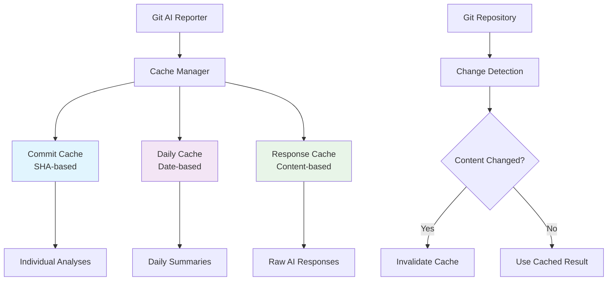

# Caching Strategy Guide

Git AI Reporter implements an intelligent caching system that dramatically reduces API costs and processing time for subsequent analyses. Understanding how caching works helps you optimize performance and manage costs effectively.

## Overview

The caching system operates at multiple levels to maximize efficiency:

- **🔍 Commit-Level Caching** - Individual commit analyses cached by SHA
- **📅 Daily Synthesis Caching** - Daily summaries cached by date range
- **🧠 AI Response Caching** - Raw AI responses cached to avoid duplicate calls
- **⚡ Smart Cache Invalidation** - Intelligent cache management based on content changes

!!! success "Performance Impact"

    Caching typically provides:
    
    - **60-80% reduction** in API calls on subsequent runs
    - **70-90% faster** processing for unchanged commits
    - **50-75% lower** API costs for regular analysis

## How Caching Works

### Cache Architecture



### Cache Levels

#### Level 1: Commit Analysis Cache

**What's Cached:** Individual commit analysis results  
**Cache Key:** Git commit SHA (immutable identifier)  
**Invalidation:** Never (commits are immutable)  
**Storage:** JSON files with commit SHA as filename

```json
{
  "commit_sha": "a1b2c3d4e5f6789",
  "cached_at": "2025-01-15T10:30:00Z",
  "analysis": {
    "changes": [
      {
        "summary": "Add user authentication middleware",
        "category": "New Feature"
      }
    ],
    "trivial": false
  },
  "processing_time_ms": 1250,
  "model_used": "gemini-2.5-flash"
}
```

#### Level 2: Daily Synthesis Cache

**What's Cached:** Daily summary and pattern analysis  
**Cache Key:** Date range + repository state hash  
**Invalidation:** When new commits added to date range  
**Storage:** Date-based cache files with content validation

```json
{
  "date": "2025-01-15",
  "repository_hash": "abc123def456",
  "cached_at": "2025-01-15T18:00:00Z",
  "commit_count": 8,
  "daily_summary": "Focused on authentication system implementation...",
  "patterns": ["authentication", "security", "middleware"],
  "processing_time_ms": 3400,
  "model_used": "gemini-2.5-pro"
}
```

#### Level 3: AI Response Cache

**What's Cached:** Raw responses from AI models  
**Cache Key:** Content hash of prompt + model + parameters  
**Invalidation:** Based on TTL and content changes  
**Storage:** Content-addressed storage with deduplication

### Cache Directory Structure

```
.git-ai-reporter-cache/
├── commits/
│   ├── a1b2c3d4e5f6789.json         # Individual commit cache
│   ├── b2c3d4e5f6789abc.json
│   └── ...
├── daily/
│   ├── 2025-01-15.json              # Daily synthesis cache
│   ├── 2025-01-16.json  
│   └── ...
├── responses/
│   ├── content_hash_abc123.json     # AI response cache
│   ├── content_hash_def456.json
│   └── ...
└── metadata/
    ├── cache_stats.json             # Cache performance metrics
    ├── config.json                  # Cache configuration
    └── index.json                   # Cache index for fast lookups
```

## Configuration

### Basic Cache Settings

```bash
# Enable/disable caching
CACHE_ENABLED=true                   # Default: true

# Cache directory location
CACHE_DIR=".git-ai-reporter-cache"   # Default location

# Cache TTL settings
CACHE_TTL_DAYS=30                    # Cache expiration (default: 30 days)
CACHE_MAX_SIZE_MB=100                # Maximum cache size (default: 100MB)

# Cache behavior
CACHE_COMPRESSION=true               # Compress cache files (default: true)
CACHE_VALIDATION=true                # Validate cache integrity (default: true)
```

### Advanced Cache Configuration

```bash
# Cache granularity control
CACHE_COMMIT_ANALYSES=true           # Cache individual commit analyses
CACHE_DAILY_SUMMARIES=true           # Cache daily synthesis results
CACHE_AI_RESPONSES=true              # Cache raw AI responses

# Cache invalidation strategy
CACHE_INVALIDATION_STRATEGY="smart"  # smart|aggressive|conservative

# Performance tuning
CACHE_CONCURRENT_READS=5             # Concurrent cache read operations
CACHE_WRITE_BATCH_SIZE=10            # Batch cache writes for performance
CACHE_INDEX_REBUILD_INTERVAL=7       # Days between index rebuilds
```

### Environment-Specific Configuration

=== "Development"

    ```bash
    # Development: Disable caching for fresh results
    CACHE_ENABLED=false
    # OR use shorter TTL for frequent changes
    CACHE_TTL_DAYS=1
    ```

=== "CI/CD"

    ```bash
    # CI/CD: Enable caching but with validation
    CACHE_ENABLED=true
    CACHE_TTL_DAYS=7
    CACHE_VALIDATION=true
    CACHE_MAX_SIZE_MB=50
    ```

=== "Production"

    ```bash
    # Production: Optimize for performance and cost
    CACHE_ENABLED=true
    CACHE_TTL_DAYS=30
    CACHE_MAX_SIZE_MB=200
    CACHE_COMPRESSION=true
    ```

## Cache Management Commands

### Viewing Cache Status

```bash
# Display cache statistics
git-ai-reporter --cache-stats

# Sample output:
# Cache Statistics
# ================
# Cache Directory: .git-ai-reporter-cache
# Total Size: 45.2 MB
# Hit Rate: 73.4% (last 100 operations)
# 
# Commit Analyses: 1,247 cached (98.2% hit rate)
# Daily Summaries: 28 cached (85.7% hit rate)  
# AI Responses: 892 cached (67.3% hit rate)
# 
# Cache Age Distribution:
# - < 7 days:   65% of entries
# - 7-30 days:  28% of entries
# - > 30 days:   7% of entries

# Check cache health
git-ai-reporter --cache-health
```

### Cache Maintenance

```bash
# Clear all cached data
git-ai-reporter --clear-cache

# Clear specific cache types
git-ai-reporter --clear-cache --type commits
git-ai-reporter --clear-cache --type daily
git-ai-reporter --clear-cache --type responses

# Clear expired cache entries
git-ai-reporter --cache-cleanup

# Rebuild cache index
git-ai-reporter --cache-rebuild-index

# Validate cache integrity
git-ai-reporter --cache-validate
```

### Cache Optimization

```bash
# Compress existing cache files
git-ai-reporter --cache-compress

# Defragment cache directory
git-ai-reporter --cache-defragment

# Optimize cache for current repository
git-ai-reporter --cache-optimize

# Preload cache with historical data
git-ai-reporter --cache-preload --weeks 4
```

## Cache Invalidation Strategies

### Smart Invalidation (Default)

Intelligently determines when cache entries should be invalidated based on content analysis.

**Triggers:**
- New commits added to previously analyzed date ranges
- Configuration changes affecting analysis behavior  
- Model version updates or parameter changes
- Repository structure changes (branch merges, rebases)

```python
# Example smart invalidation logic
def should_invalidate_daily_cache(date, current_commits):
    cached_data = load_daily_cache(date)
    if not cached_data:
        return True
        
    # Check if new commits added to this date
    cached_commit_count = cached_data.get('commit_count', 0)
    current_commit_count = len(get_commits_for_date(date))
    
    if current_commit_count != cached_commit_count:
        return True
        
    # Check if repository state changed
    cached_repo_hash = cached_data.get('repository_hash')
    current_repo_hash = calculate_repo_hash(date)
    
    return cached_repo_hash != current_repo_hash
```

### Aggressive Invalidation

Frequently invalidates cache to ensure freshness at the cost of performance.

**Best for:** Development environments, frequent configuration changes  
**Configuration:** `CACHE_INVALIDATION_STRATEGY="aggressive"`

**Triggers:**
- Daily cache expires after 1 day
- Any configuration change invalidates all caches
- Git repository changes trigger broad invalidation

### Conservative Invalidation

Maximizes cache utilization, suitable for stable environments.

**Best for:** Production environments, cost optimization  
**Configuration:** `CACHE_INVALIDATION_STRATEGY="conservative"`

**Triggers:**
- Only explicit content changes trigger invalidation
- Configuration changes only affect new analyses
- Long TTL periods (30+ days)

## Cache Performance Optimization

### Hit Rate Optimization

**Target Hit Rates:**
- **Commit Analyses:** 90%+ (commits are immutable)
- **Daily Summaries:** 70-80% (depends on new activity)
- **AI Responses:** 60-70% (varies by analysis patterns)

**Optimization Strategies:**

```bash
# 1. Increase cache size for better retention
CACHE_MAX_SIZE_MB=200

# 2. Use longer TTL for stable repositories
CACHE_TTL_DAYS=60

# 3. Enable compression to store more entries
CACHE_COMPRESSION=true

# 4. Preload cache with historical data
git-ai-reporter --cache-preload --since "2024-01-01"
```

### Storage Optimization

**Compression:** Reduces cache storage by 60-70%

```bash
# Enable compression
CACHE_COMPRESSION=true

# Compress existing cache
git-ai-reporter --cache-compress

# Check compression ratio
git-ai-reporter --cache-stats --verbose
```

**Deduplication:** Eliminates duplicate AI responses

```bash
# Enable automatic deduplication
CACHE_DEDUPLICATION=true

# Manual deduplication
git-ai-reporter --cache-deduplicate
```

### Performance Monitoring

```bash
# Monitor cache performance during analysis
git-ai-reporter --weeks 2 --cache-monitor

# Generate cache performance report
git-ai-reporter --cache-report --output cache-report.md

# Performance benchmarking
git-ai-reporter --benchmark --with-cache vs --benchmark --no-cache
```

## Cache in Different Environments

### Local Development

**Strategy:** Fast iteration with selective caching

```bash
# Cache configuration for development
CACHE_ENABLED=true
CACHE_TTL_DAYS=7                     # Short TTL for frequent changes
CACHE_COMMIT_ANALYSES=true           # Cache expensive analyses
CACHE_DAILY_SUMMARIES=false          # Fresh synthesis for current work
CACHE_AI_RESPONSES=false             # Always fresh AI responses
```

**Workflow:**
```bash
# Clear cache when testing configuration changes
git-ai-reporter --clear-cache --type daily
git-ai-reporter --weeks 1

# Keep commit cache for performance
git-ai-reporter --clear-cache --type daily,responses
```

### CI/CD Pipelines

**Strategy:** Efficient automated analysis with controlled caching

```bash
# CI/CD cache configuration
CACHE_ENABLED=true
CACHE_TTL_DAYS=14                    # Balance freshness and performance
CACHE_MAX_SIZE_MB=50                 # Limit for CI/CD storage constraints
CACHE_COMPRESSION=true               # Optimize for transfer and storage
CACHE_VALIDATION=true                # Ensure cache integrity
```

**Pipeline Integration:**
```yaml
# Example GitHub Actions cache integration
- name: Cache Git AI Reporter data
  uses: actions/cache@v3
  with:
    path: .git-ai-reporter-cache
    key: git-ai-cache-${{ github.sha }}
    restore-keys: |
      git-ai-cache-${{ github.ref_name }}
      git-ai-cache-main

- name: Generate analysis with caching
  run: |
    git-ai-reporter --weeks 1 --cache-enabled
```

### Production Environments

**Strategy:** Maximum cost efficiency with intelligent caching

```bash
# Production cache configuration
CACHE_ENABLED=true
CACHE_TTL_DAYS=30                    # Long retention for cost efficiency
CACHE_MAX_SIZE_MB=500                # Large cache for high hit rates
CACHE_COMPRESSION=true               # Storage optimization
CACHE_INVALIDATION_STRATEGY="smart"  # Intelligent invalidation
```

**Maintenance Schedule:**
```bash
# Weekly cache maintenance (cron job)
0 2 * * 0 git-ai-reporter --cache-cleanup --cache-optimize

# Monthly cache health check
0 3 1 * * git-ai-reporter --cache-health --cache-report
```

## Troubleshooting Cache Issues

### Common Cache Problems

??? failure "Low cache hit rate"

    **Problem:** Cache hit rate below 50%, high API costs.
    
    **Diagnosis:**
    ```bash
    git-ai-reporter --cache-stats --verbose
    git-ai-reporter --cache-health
    ```
    
    **Solutions:**
    ```bash
    # Increase cache size
    CACHE_MAX_SIZE_MB=200
    
    # Use conservative invalidation
    CACHE_INVALIDATION_STRATEGY="conservative"
    
    # Preload historical data
    git-ai-reporter --cache-preload --weeks 8
    ```

??? failure "Cache directory growing too large"

    **Problem:** Cache consuming excessive disk space.
    
    **Solutions:**
    ```bash
    # Enable compression
    CACHE_COMPRESSION=true
    git-ai-reporter --cache-compress
    
    # Reduce TTL
    CACHE_TTL_DAYS=14
    
    # Clean expired entries
    git-ai-reporter --cache-cleanup
    
    # Set size limits
    CACHE_MAX_SIZE_MB=100
    ```

??? failure "Stale or incorrect cached results"

    **Problem:** Cache returning outdated information.
    
    **Solutions:**
    ```bash
    # Force cache refresh
    git-ai-reporter --no-cache --weeks 2
    
    # Clear problematic cache types
    git-ai-reporter --clear-cache --type daily
    
    # Use aggressive invalidation temporarily
    CACHE_INVALIDATION_STRATEGY="aggressive"
    ```

??? failure "Cache corruption or validation errors"

    **Problem:** Cache integrity validation failures.
    
    **Solutions:**
    ```bash
    # Validate and repair cache
    git-ai-reporter --cache-validate --cache-repair
    
    # Rebuild cache index
    git-ai-reporter --cache-rebuild-index
    
    # Nuclear option: clear and rebuild
    git-ai-reporter --clear-cache
    git-ai-reporter --cache-preload --weeks 4
    ```

### Performance Issues

??? warning "Slow cache operations"

    **Problem:** Cache reads/writes causing performance bottlenecks.
    
    **Solutions:**
    ```bash
    # Increase concurrent operations
    CACHE_CONCURRENT_READS=10
    
    # Enable batch operations
    CACHE_WRITE_BATCH_SIZE=20
    
    # Defragment cache directory
    git-ai-reporter --cache-defragment
    ```

### Debugging Cache Behavior

```bash
# Enable cache debug logging
git-ai-reporter --debug --cache-verbose --weeks 1

# Trace cache operations
git-ai-reporter --cache-trace --weeks 1 2>&1 | grep "CACHE"

# Generate detailed cache report
git-ai-reporter --cache-report --detailed --output cache-debug.json
```

## Best Practices

### Cache Strategy Guidelines

1. **Enable caching in production** - Significant cost and time savings
2. **Use conservative TTL** - Balance freshness with performance
3. **Monitor hit rates** - Aim for 70%+ overall hit rate
4. **Regular maintenance** - Clean up expired entries weekly
5. **Environment-specific config** - Different strategies per environment

### Storage Management

1. **Set reasonable size limits** - Prevent unlimited growth
2. **Enable compression** - 60-70% storage reduction
3. **Monitor disk usage** - Include in system monitoring
4. **Backup cache data** - For critical production environments
5. **Plan for growth** - Scale cache limits with repository size

### Performance Tuning

1. **Preload historical data** - Better hit rates for initial runs
2. **Tune concurrent operations** - Match system capabilities
3. **Use SSD storage** - Significant I/O performance improvement
4. **Monitor cache latency** - Ensure cache operations aren't bottlenecks
5. **Profile cache patterns** - Optimize for actual usage patterns

## Cache Security Considerations

### Data Protection

```bash
# Ensure proper file permissions
chmod 700 .git-ai-reporter-cache/
find .git-ai-reporter-cache/ -type f -exec chmod 600 {} \;

# Exclude cache from version control
echo '.git-ai-reporter-cache/' >> .gitignore
```

### Sensitive Data Handling

- Cache files may contain code snippets and commit messages
- Ensure cache directory has appropriate access restrictions
- Consider cache encryption for highly sensitive repositories
- Regular cache cleanup prevents data accumulation

## Related Resources

- **[Performance Guide →](performance.md)** - Overall performance optimization
- **[Configuration Guide →](../installation/configuration.md)** - Complete configuration reference
- **[Troubleshooting →](troubleshooting.md)** - Solve caching and performance issues
- **[CLI Reference →](../cli/options.md)** - Cache-related command options