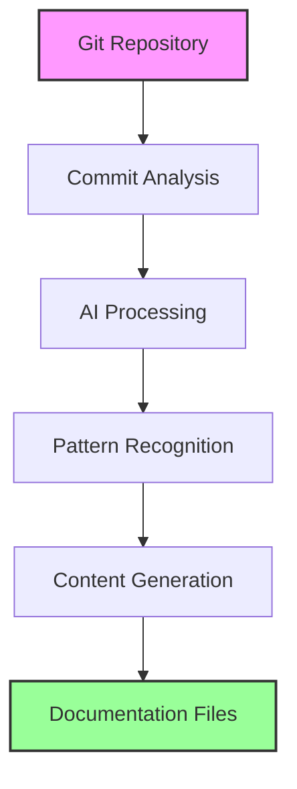

# User Guide

Welcome to the Git AI Reporter User Guide. This comprehensive guide will help you master all features and capabilities of the tool.

## Guide Overview

This guide is organized into several sections to help you find information quickly:

### Core Concepts
- **[Understanding the Tool](concepts.md)** - How Git AI Reporter works
- **[Three-Tier AI Architecture](../architecture/index.md)** - The intelligence behind the analysis
- **[Output Formats](output-formats.md)** - Understanding generated documentation

### Usage Patterns
- **[Basic Usage](basic-usage.md)** - Essential commands and workflows
- **[Advanced Features](advanced-usage.md)** - Power user capabilities

### Customization
- **[Configuration Options](configuration.md)** - Tailoring the tool to your needs
- **[Custom Templates](templates.md)** - Modifying output formats
- **[Integration Guide](integration.md)** - Incorporating into your workflow

### Troubleshooting
- **[Common Issues](troubleshooting.md)** - Solutions to frequent problems
- **[Performance Tuning](performance.md)** - Optimizing for large repositories
- **[FAQ](faq.md)** - Frequently asked questions

## Quick Navigation

<div class="grid cards">
  <div class="card">
    <h3>🎯 Getting Started</h3>
    <p>New to Git AI Reporter? Start with basic usage patterns and core concepts.</p>
    <a href="basic-usage/" class="md-button">Basic Usage →</a>
  </div>
  
  <div class="card">
    <h3>⚡ Advanced Features</h3>
    <p>Ready to unlock the full potential? Explore advanced capabilities and customization.</p>
    <a href="advanced-usage/" class="md-button">Advanced Guide →</a>
  </div>
  
  <div class="card">
    <h3>🔧 Configuration</h3>
    <p>Customize Git AI Reporter to match your workflow and preferences.</p>
    <a href="configuration/" class="md-button">Configure →</a>
  </div>
  
  <div class="card">
    <h3>❓ Troubleshooting</h3>
    <p>Having issues? Find solutions and answers to common questions.</p>
    <a href="troubleshooting/" class="md-button">Get Help →</a>
  </div>
</div>

## Understanding Git AI Reporter

Git AI Reporter transforms your Git commit history into three types of intelligent documentation:

### 📰 NEWS.md - Development Narratives
A story-driven summary of your development progress, perfect for:
- Stakeholder updates
- Sprint retrospectives
- Release announcements
- Project status reports

### 📋 CHANGELOG.txt - Structured Changes
A Keep a Changelog compliant format with emoji categorization, ideal for:
- Version history tracking
- Technical documentation
- Migration guides
- API change logs

### 📅 DAILY_UPDATES.md - Daily Summaries
Day-by-day development activity tracking, useful for:
- Daily standups
- Team synchronization
- Progress monitoring
- Velocity tracking

## How It Works



1. **Repository Analysis**: Scans your Git history for commits
2. **Intelligent Filtering**: Removes noise (docs, style changes)
3. **AI Understanding**: Gemini models analyze code changes
4. **Pattern Recognition**: Identifies themes and relationships
5. **Content Generation**: Creates human-readable documentation

## Key Features

### 🚀 Performance
- **Async Processing**: 5-10x faster than sequential analysis
- **Smart Caching**: Reduces API costs by 70%
- **Progress Tracking**: Real-time updates with ETA

### 🎯 Intelligence
- **Three-Tier AI**: Optimized model selection for each task
- **Context Awareness**: Understands project evolution
- **Pattern Recognition**: Identifies development trends

### 🔒 Security
- **Supply Chain Security**: Digital attestations on PyPI
- **No Data Storage**: Your code never leaves your machine
- **API Key Protection**: Secure credential management

### 📊 Flexibility
- **Date Range Control**: Analyze any time period
- **Multiple Formats**: Three complementary output types
- **Incremental Updates**: Efficient changelog merging

## Common Workflows

### Weekly Team Updates
```bash
# Every Monday morning
git-ai-reporter --days 7
```

### Sprint Retrospectives
```bash
# Two-week sprint summary
git-ai-reporter --days 14
```

### Release Documentation
```bash
# Since last release tag
git-ai-reporter --since v1.0.0
```

### Monthly Reports
```bash
# Full month analysis
git-ai-reporter --since 2025-01-01 --until 2025-01-31
```

## Best Practices Summary

1. **Write Clear Commit Messages**: The AI relies on your commit quality
2. **Use Conventional Commits**: Improves categorization accuracy
3. **Regular Analysis**: Run weekly for best results
4. **Cache Management**: Let the tool handle caching automatically
5. **Review Output**: AI-generated content benefits from human review

## Getting Help

- **In-Tool Help**: Run `git-ai-reporter --help`
- **Documentation**: You're reading it!
- **GitHub Issues**: [Report problems](https://github.com/paudley/git-ai-reporter/issues)
- **Discussions**: [Ask questions](https://github.com/paudley/git-ai-reporter/discussions)

## Next Steps

Ready to dive deeper? Choose your path:

- 📚 [Basic Usage](basic-usage.md) - Start with fundamentals
- ⚡ [Advanced Features](advanced-usage.md) - Unlock full potential
- 🎨 [Customization](configuration.md) - Make it yours
- 🏗️ [Architecture Details](../architecture/index.md) - Technical deep dive