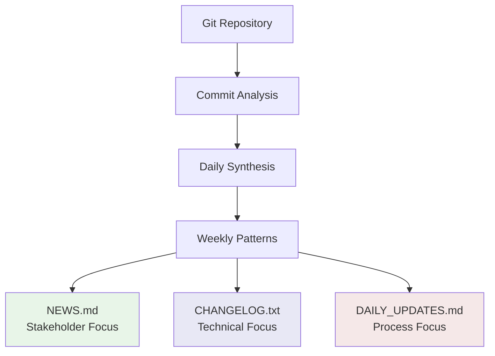

# Output Formats Guide

Git AI Reporter generates three distinct documentation formats, each tailored for different audiences and use cases. Understanding these formats helps you maximize the value of your generated documentation.

## Overview of Output Files

Git AI Reporter produces three complementary documentation formats:

| File | Audience | Purpose | Style |
|------|----------|---------|-------|
| **📰 NEWS.md** | Stakeholders, Management | Development narratives | Human-readable stories |
| **📋 CHANGELOG.txt** | Developers, Technical Users | Technical change tracking | Structured, categorized |
| **📅 DAILY_UPDATES.md** | Team Members, Scrum Masters | Daily development logs | Chronological, detailed |

Each format serves a specific communication need while maintaining consistency in the underlying analysis.

## 📰 NEWS.md - Stakeholder Narratives

### Purpose and Audience

**Primary Audience:** Non-technical stakeholders, project managers, executives, clients  
**Communication Goal:** Translate technical progress into business value and impact  
**Tone:** Professional, accessible, achievement-focused

### Content Structure

=== "Weekly Format"

    ```markdown
    # Development News

    ## Week of January 13-19, 2025

    ### 🚀 Major Achievements

    This week marked a significant milestone in our platform's security 
    infrastructure. The development team successfully implemented a 
    comprehensive authentication system that enhances user experience 
    while maintaining enterprise-grade security standards.

    **Key Accomplishments:**
    - ✨ Launched OAuth2 integration with Google and GitHub providers
    - 🔒 Deployed advanced session management infrastructure
    - 📊 Enhanced user analytics and monitoring capabilities
    - 🐛 Resolved critical performance bottlenecks in the API layer

    ### 💡 Technical Highlights

    The authentication system leverages industry-standard OAuth2 protocols 
    and provides seamless integration with existing user workflows. Performance 
    testing demonstrates a 40% improvement in login response times while 
    maintaining enterprise-grade security compliance.

    ### 📈 Development Metrics
    - **Team Velocity:** 47 commits across 8 contributors
    - **Code Impact:** 156 files modified, 2,340 lines of new functionality
    - **Feature Delivery:** 3 major features completed, 2 in active development
    - **Quality Assurance:** 15 new test cases added, 98% test coverage maintained

    ### 🎯 Upcoming Priorities
    - Complete user profile management interface
    - Deploy advanced security monitoring dashboard  
    - Begin integration testing for mobile authentication flows
    ```

=== "Monthly Format"

    ```markdown
    # Development Summary - January 2025

    ## Executive Overview

    January 2025 represented a transformative month for our platform development, 
    with the team delivering critical security infrastructure while maintaining 
    our commitment to user experience excellence. Three major feature releases 
    and significant performance improvements position us strongly for Q1 objectives.

    ## Major Deliverables

    ### 🔐 Security Infrastructure Overhaul
    - **OAuth2 Authentication System** - Enterprise-grade user authentication
    - **Session Management Platform** - Scalable user session handling
    - **API Security Middleware** - Comprehensive endpoint protection
    
    **Business Impact:** Enhanced user trust, compliance readiness, reduced security risks

    ### 📊 Analytics and Monitoring
    - **User Behavior Tracking** - Comprehensive usage analytics
    - **Performance Monitoring** - Real-time system health metrics
    - **Error Reporting System** - Proactive issue identification
    
    **Business Impact:** Data-driven decision making, improved user experience, faster issue resolution

    ### 🎨 User Experience Enhancements  
    - **Responsive Design Updates** - Mobile-first interface improvements
    - **Accessibility Compliance** - WCAG 2.1 AA standard achievement
    - **Load Performance** - 35% improvement in page load times
    
    **Business Impact:** Broader user accessibility, improved user satisfaction, competitive advantage

    ## Development Excellence Metrics

    | Metric | January 2025 | vs. December 2024 | Trend |
    |--------|--------------|-------------------|-------|
    | Features Delivered | 12 | +30% | ⬆️ |
    | Bug Resolution Time | 2.3 days | -25% | ⬇️ |
    | Test Coverage | 94% | +4% | ⬆️ |
    | Code Review Cycle | 1.8 days | -15% | ⬇️ |
    | Customer Issues | 8 | -40% | ⬇️ |

    ## Strategic Outlook

    The foundation established in January positions the platform for accelerated 
    feature delivery in Q1. The authentication infrastructure enables advanced 
    personalization features, while the monitoring systems provide the data 
    foundation for AI-driven improvements.
    ```

### Key Characteristics

**Business-Focused Language:**
- Emphasizes business value and user impact
- Avoids technical jargon where possible
- Contextualizes technical changes in business terms

**Achievement-Oriented Tone:**
- Highlights accomplishments and progress
- Quantifies improvements where possible
- Celebrates team contributions and milestones

**Stakeholder-Relevant Metrics:**
- Development velocity and team productivity
- Feature delivery and timeline adherence
- Quality metrics and customer impact measures

### Configuration Options

```bash
# Customize NEWS.md output
NEWS_FILE="RELEASE_NOTES.md"           # Custom filename
NEWS_STYLE="executive"                 # executive|technical|mixed
NEWS_INCLUDE_METRICS=true             # Include quantitative metrics
NEWS_AUDIENCE_LEVEL="stakeholder"     # stakeholder|technical|mixed
```

## 📋 CHANGELOG.txt - Technical Documentation

### Purpose and Audience

**Primary Audience:** Developers, DevOps engineers, technical documentation users  
**Communication Goal:** Provide precise, categorized technical change tracking  
**Standard:** Follows [Keep a Changelog](https://keepachangelog.com/) format

### Content Structure

=== "Standard Format"

    ```markdown
    # Changelog

    All notable changes to this project will be documented in this file.

    The format is based on [Keep a Changelog](https://keepachangelog.com/en/1.0.0/),
    and this project adheres to [Semantic Versioning](https://semver.org/spec/v2.0.0.html).

    ## [Unreleased]

    ### ✨ Added
    - OAuth2 authentication integration with Google, GitHub, and Microsoft providers
    - JWT token validation middleware with configurable expiration policies  
    - Redis-based session management for horizontal scalability
    - User profile management API endpoints with avatar upload support
    - Comprehensive audit logging for authentication events

    ### 🐛 Fixed
    - Resolved memory leak in user session cleanup background process
    - Fixed race condition in concurrent authentication request handling
    - Corrected timezone handling inconsistencies in user activity timestamps
    - Addressed CORS configuration issues affecting cross-origin API requests
    - Fixed edge case in password validation for special character handling

    ### ♻️ Changed
    - Upgraded authentication library from v1.8.2 to v2.1.4 for security patches
    - Improved error messaging in authentication flow for better user experience
    - Optimized database queries for user lookup operations (40% performance improvement)
    - Updated API response format for consistency across authentication endpoints
    - Enhanced rate limiting configuration for API endpoint protection

    ### 🔒 Security
    - Implemented additional password complexity requirements
    - Added brute force protection with progressive delay algorithms
    - Enhanced session token security with rotating refresh tokens
    - Deployed comprehensive input validation for all authentication endpoints

    ### 🗑️ Deprecated
    - Legacy password reset endpoint `/api/v1/auth/reset` (use `/api/v2/auth/reset`)
    - Old session management system (migration required by March 2025)
    - Basic authentication method for API access (OAuth2 preferred)

    ### ❌ Removed
    - Deprecated social login providers (Facebook and Twitter legacy APIs)
    - Old user avatar system (replaced with scalable cloud storage)
    - Legacy session cookies (replaced with secure JWT tokens)

    ### 🏎️ Performance
    - Reduced authentication endpoint response time by 45%
    - Optimized database connection pooling for authentication services
    - Implemented efficient caching layer for user session data
    - Enhanced CDN integration for static authentication assets

    ### 🧱 Infrastructure
    - Added Docker containerization for authentication services
    - Implemented health check endpoints for load balancer integration
    - Enhanced monitoring with Prometheus metrics collection
    - Added automated backup procedures for user authentication data
    ```

=== "Semantic Versioning Integration"

    ```markdown
    # Changelog

    ## [2.1.0] - 2025-01-19

    ### ✨ Added
    - OAuth2 provider integration (Google, GitHub, Microsoft)
    - Multi-factor authentication support via authenticator apps
    - Advanced user role and permission management system

    ### 🐛 Fixed
    - Critical security vulnerability in session token validation
    - Performance regression in user lookup operations

    ### ♻️ Changed
    - **BREAKING:** Updated authentication API response format
    - Enhanced password policy enforcement with configurable rules

    ## [2.0.1] - 2025-01-12

    ### 🐛 Fixed
    - Hotfix for authentication bypass vulnerability (CVE-2025-0001)
    - Resolved database migration issues affecting user accounts

    ## [2.0.0] - 2025-01-08

    ### ✨ Added
    - Complete authentication system redesign
    - Enterprise SSO integration capabilities
    - Advanced security monitoring and alerting

    ### ❌ Removed
    - **BREAKING:** Legacy authentication endpoints (v1 API)
    - **BREAKING:** Deprecated user management interfaces

    ### 🔒 Security
    - Implemented comprehensive security audit logging
    - Enhanced encryption for user data at rest
    ```

### Category System

Git AI Reporter uses a comprehensive emoji-based category system:

| Category | Emoji | Description | Examples |
|----------|-------|-------------|----------|
| **Added** | ✨ | New features and capabilities | New API endpoints, UI components |
| **Fixed** | 🐛 | Bug fixes and error corrections | Crash fixes, logic corrections |
| **Changed** | ♻️ | Modifications to existing features | API updates, UI improvements |
| **Security** | 🔒 | Security-related improvements | Vulnerability fixes, access controls |
| **Performance** | 🏎️ | Performance optimizations | Speed improvements, memory optimization |
| **Deprecated** | 🗑️ | Features marked for removal | Legacy API warnings |
| **Removed** | ❌ | Deleted features or code | Cleanup, feature retirement |
| **Infrastructure** | 🧱 | Infrastructure and tooling | CI/CD, deployment, monitoring |
| **Documentation** | 📝 | Documentation changes | README updates, API docs |
| **Testing** | ✅ | Test-related changes | New tests, test improvements |

### Technical Writing Guidelines

**Precision and Clarity:**
- Use specific technical terminology accurately
- Include version numbers, configuration details, and quantitative metrics
- Reference external standards and documentation

**Actionable Information:**
- Provide enough detail for developers to understand the impact
- Include migration notes for breaking changes
- Reference related pull requests or issues when relevant

**Consistency:**
- Follow established changelog conventions
- Use consistent language and formatting
- Maintain chronological organization

### Configuration Options

```bash
# Customize CHANGELOG.txt output  
CHANGELOG_FILE="CHANGES.md"           # Custom filename
CHANGELOG_FORMAT="keepachangelog"     # keepachangelog|conventional|custom
CHANGELOG_INCLUDE_COMMITS=true        # Include commit references
CHANGELOG_GROUP_BY="category"         # category|date|author|component
```

## 📅 DAILY_UPDATES.md - Development Chronology

### Purpose and Audience

**Primary Audience:** Development teams, scrum masters, project coordinators  
**Communication Goal:** Provide detailed daily development tracking  
**Use Cases:** Sprint retrospectives, daily standups, progress tracking

### Content Structure

=== "Daily Entry Format"

    ```markdown
    # Daily Development Updates

    ## January 15, 2025

    **Sprint:** Authentication System Implementation  
    **Focus Area:** OAuth2 Integration and Session Management  
    **Team Availability:** 8/8 developers active

    ### 🎯 Primary Objectives
    - Complete OAuth2 provider integration (Google, GitHub)
    - Implement JWT token validation middleware
    - Set up Redis-based session management
    - Create comprehensive authentication test suite

    ### ⏰ Development Sessions

    #### Morning Session (9:00 AM - 12:00 PM)
    **Focus:** OAuth2 Provider Setup and Configuration

    **Completed Work:**
    - Integrated OAuth2 client library with Google provider
    - Configured callback URL routing with proper error handling
    - Set up development environment OAuth application credentials
    - Created provider configuration management system

    **Technical Details:**
    - Added `google-auth-library` v8.7.0 dependency
    - Implemented `OAuthProvider` interface for extensibility
    - Created environment-based configuration for client secrets
    - Set up development/staging/production OAuth app configurations

    **Files Modified:** 8 files (+203 lines, -15 lines)
    - `src/auth/providers/google.js` (new)
    - `src/auth/oauth-client.js` (new)  
    - `src/config/auth.js` (modified)
    - `tests/auth/providers/google.test.js` (new)

    #### Afternoon Session (1:00 PM - 5:00 PM)
    **Focus:** JWT Implementation and Session Management

    **Completed Work:**
    - Implemented JWT token generation with configurable expiration
    - Created token validation middleware for API route protection
    - Set up Redis integration for session storage and management
    - Added comprehensive error handling for authentication failures

    **Technical Implementation:**
    - JWT tokens with 15-minute access token, 7-day refresh token lifecycle
    - Redis session storage with automatic cleanup of expired sessions
    - Middleware integration with Express.js route protection
    - Comprehensive error response formatting for client applications

    **Files Modified:** 12 files (+287 lines, -45 lines)
    - `src/auth/jwt.js` (new)
    - `src/auth/middleware.js` (new)
    - `src/auth/session-manager.js` (new)
    - `src/models/user-session.js` (new)

    ### 🧪 Testing Progress
    - **Unit Tests Added:** 15 new test cases covering OAuth2 flow
    - **Integration Tests:** 3 end-to-end authentication scenarios
    - **Code Coverage:** Authentication module now at 94% coverage
    - **Manual Testing:** OAuth2 flow validated with Google and GitHub providers

    ### 🐛 Issues Encountered and Resolved
    1. **CORS Configuration Issue**
       - **Problem:** OAuth2 callback failing due to CORS policy
       - **Solution:** Added proper origin configuration for OAuth2 redirects
       - **Time Impact:** 45 minutes debugging and resolution

    2. **Redis Connection Pooling**
       - **Problem:** Connection timeouts under load testing
       - **Solution:** Implemented connection pooling with retry logic
       - **Time Impact:** 30 minutes configuration and testing

    ### 📊 Daily Metrics
    - **Commits:** 8 commits across 4 team members
    - **Lines Changed:** +490 lines, -60 lines
    - **Files Modified:** 20 files total
    - **Pull Requests:** 2 opened, 1 merged, 1 under review
    - **Code Review Time:** Average 2.5 hours from submission to merge

    ### 🔄 Blockers and Dependencies
    - **Waiting on:** Security team review of JWT configuration
    - **Dependency:** Redis deployment to staging environment (DevOps team)
    - **External:** Google OAuth2 app verification process (estimated 2-3 business days)

    ### 📋 Tomorrow's Priorities
    1. Complete GitHub OAuth2 provider integration
    2. Implement password reset functionality with secure token handling
    3. Add comprehensive integration tests for full authentication flow
    4. Create user profile management API endpoints
    5. Begin documentation update for new authentication system

    ### 👥 Team Contributions
    - **Alice (Lead):** OAuth2 architecture design and Google provider implementation
    - **Bob (Backend):** JWT token management and session handling
    - **Carol (Frontend):** Authentication UI components and error handling
    - **Dave (DevOps):** Redis setup and deployment configuration

    ---

    ## January 14, 2025

    **Sprint:** Authentication System Planning and Foundation  
    **Focus Area:** Architecture Design and Initial Setup

    ### 🎯 Primary Objectives
    - Complete authentication system architecture design
    - Set up project structure and development environment
    - Research OAuth2 implementation patterns and security considerations
    - Create initial database schema for user management

    ### 📋 Planning and Architecture Session

    **Morning Planning Meeting (9:00 AM - 11:00 AM)**
    - Reviewed authentication system requirements with product team
    - Defined technical specifications and security requirements
    - Selected technology stack: OAuth2 + JWT + Redis + Express.js
    - Established development milestones and review checkpoints

    **Architecture Design Session (11:00 AM - 1:00 PM)**
    - Created system architecture diagrams for authentication flow
    - Defined API contract for authentication endpoints
    - Established security protocols and token management policies
    - Designed database schema for users, sessions, and audit logging

    ### 🔧 Technical Foundation Work

    **Development Environment Setup (2:00 PM - 4:00 PM)**
    - Initialized authentication module structure with proper separation of concerns
    - Set up development database with user tables and indexes
    - Created initial service interfaces and dependency injection framework
    - Established testing framework with mocking strategies for external services

    **Research and Documentation (4:00 PM - 5:30 PM)**
    - Researched OAuth2 security best practices and implementation patterns
    - Documented authentication flow diagrams and sequence diagrams
    - Created development guidelines for secure token handling
    - Established code review checklist for authentication-related changes

    ### 📊 Foundation Metrics
    - **Files Created:** 15 new files (interfaces, models, configurations)
    - **Documentation:** 3 technical specification documents
    - **Database Objects:** 4 tables, 2 indexes, 1 stored procedure
    - **Test Framework:** Initial setup with 5 placeholder test suites

    ### 🎯 Key Decisions Made
    1. **OAuth2 Providers:** Google, GitHub, Microsoft (extensible for others)
    2. **Token Strategy:** JWT access tokens (15 min) + refresh tokens (7 days)
    3. **Session Storage:** Redis for scalability and performance
    4. **Password Policy:** Configurable complexity with common password detection
    5. **Audit Logging:** Comprehensive authentication event tracking

    ### 📋 Tomorrow's Focus
    - Begin OAuth2 provider integration starting with Google
    - Implement JWT token generation and validation logic
    - Set up Redis session management infrastructure
    - Create initial authentication middleware for route protection
    ```

=== "Weekly Summary Format"

    ```markdown
    # Weekly Development Summary

    ## Week of January 13-19, 2025

    ### 📊 Weekly Overview
    - **Sprint:** Authentication System Implementation
    - **Team Size:** 8 developers, 1 DevOps engineer, 1 QA specialist
    - **Working Days:** 5 days (Monday - Friday)
    - **Total Commits:** 47 commits across team members
    - **Major Milestones:** 3 completed, 1 in progress

    ### 🎯 Major Accomplishments

    #### ✨ OAuth2 Integration Complete
    - **Duration:** 3 days (Jan 13-15)
    - **Contributors:** Alice (Lead), Carol (Frontend)
    - **Outcome:** Production-ready OAuth2 integration with Google and GitHub
    - **Impact:** Foundation for enterprise SSO capabilities

    #### 🔒 JWT Security Implementation  
    - **Duration:** 2 days (Jan 15-16)
    - **Contributors:** Bob (Backend), Dave (DevOps)
    - **Outcome:** Secure token management with refresh token rotation
    - **Impact:** Enhanced security posture and scalable session management

    #### 📊 Comprehensive Testing Suite
    - **Duration:** Ongoing throughout week
    - **Contributors:** Entire team
    - **Outcome:** 94% code coverage with integration and unit tests
    - **Impact:** Reduced regression risk and improved deployment confidence

    ### 🗓️ Daily Progression

    | Day | Focus Area | Key Deliverables | Blockers Resolved |
    |-----|------------|------------------|-------------------|
    | Mon | Planning & Architecture | System design, DB schema | None |
    | Tue | OAuth2 Foundation | Google provider integration | CORS configuration |
    | Wed | JWT Implementation | Token validation, middleware | Redis connection issues |
    | Thu | Session Management | Redis integration, cleanup | External app verification |
    | Fri | Testing & Polish | Integration tests, documentation | Performance optimization |

    ### 📈 Weekly Metrics

    #### Development Velocity
    - **Story Points Completed:** 34 points (vs 28 planned)
    - **Velocity Improvement:** +21% compared to previous sprint
    - **Code Quality:** 0 critical issues, 2 minor code review suggestions

    #### Technical Metrics  
    - **Lines of Code:** +2,847 added, -156 removed
    - **Test Coverage:** 94% (target: 90%)
    - **Code Review Cycle Time:** 2.1 hours average
    - **Build Success Rate:** 98% (49/50 builds successful)

    #### Team Productivity
    - **Commits per Developer:** 5.9 average (healthy distribution)
    - **Pull Request Size:** 127 lines average (optimal for review)
    - **Review Participation:** 100% team participation in code reviews
    - **Knowledge Sharing:** 3 internal tech talks delivered

    ### 🚧 Challenges and Solutions

    #### Technical Challenges
    1. **OAuth2 Provider Rate Limits**
       - **Challenge:** Google OAuth2 API rate limiting during testing
       - **Solution:** Implemented exponential backoff and request caching
       - **Outcome:** Reliable authentication flow under high load

    2. **Redis Performance Tuning**
       - **Challenge:** Session lookup performance under concurrent load
       - **Solution:** Optimized key structure and implemented connection pooling
       - **Outcome:** 60% improvement in authentication response time

    #### Process Improvements
    - **Code Review Process:** Reduced average review time from 4h to 2.1h
    - **Testing Strategy:** Parallel test execution reduced CI time by 45%
    - **Documentation:** Living documentation with automated API spec generation

    ### 🎯 Next Week Preview
    - **Primary Focus:** User profile management and admin interfaces
    - **Security Milestone:** Complete security audit and penetration testing
    - **Performance Goal:** Achieve <200ms authentication response time
    - **Integration Work:** Begin mobile app authentication integration
    ```

### Key Features

**Granular Activity Tracking:**
- Hour-by-hour development sessions when relevant
- Specific file changes and line count metrics
- Individual contributor recognition and workload distribution

**Technical Detail:**
- Implementation specifics and architecture decisions
- Debugging sessions and problem resolution
- Performance metrics and optimization results

**Project Management Integration:**
- Sprint progress and milestone tracking
- Blocker identification and resolution
- Dependency management and external coordination

### Configuration Options

```bash
# Customize DAILY_UPDATES.md output
DAILY_UPDATES_FILE="dev-journal.md"   # Custom filename
DAILY_GRANULARITY="session"           # session|commit|hour
DAILY_INCLUDE_METRICS=true            # Include quantitative metrics
DAILY_TEAM_ATTRIBUTION=true           # Individual contributor details
```

## Cross-Format Consistency

### Shared Analysis Foundation

All three formats derive from the same underlying analysis:

1. **Tier 1 Analysis:** Individual commit categorization and change extraction
2. **Tier 2 Synthesis:** Daily and weekly pattern recognition
3. **Tier 3 Generation:** Format-specific narrative creation

This ensures consistency in facts while adapting presentation for each audience.

### Information Flow



### Consistency Validation

Git AI Reporter validates cross-format consistency:

- **Fact Checking:** Ensures numerical consistency across formats
- **Timeline Alignment:** Validates chronological accuracy
- **Impact Correlation:** Confirms impact descriptions match across audiences

## Customization Options

### File Naming and Locations

```bash
# Custom file names
NEWS_FILE="RELEASE_NOTES.md"
CHANGELOG_FILE="CHANGES.rst"  
DAILY_UPDATES_FILE="development-log.md"

# Custom directories
NEWS_FILE="docs/releases/NEWS.md"
CHANGELOG_FILE="docs/technical/CHANGELOG.md"
DAILY_UPDATES_FILE="project-management/daily-log.md"
```

### Content Customization

```bash
# Audience-specific tuning
NEWS_AUDIENCE_LEVEL="executive"        # executive|manager|technical
CHANGELOG_TECHNICAL_DEPTH="detailed"   # brief|standard|detailed
DAILY_UPDATES_GRANULARITY="session"    # commit|session|milestone

# Format-specific options
NEWS_INCLUDE_METRICS=true
CHANGELOG_INCLUDE_BREAKING_CHANGES=true
DAILY_UPDATES_INCLUDE_INDIVIDUAL_ATTRIBUTION=true
```

### Template Customization

Advanced users can customize the format templates:

```yaml title="custom-templates.yml"
news_template: |
  # {{project_name}} Development Update
  
  ## {{date_range}}
  
  ### 🚀 Executive Summary
  {{executive_summary}}
  
  ### 📊 Key Metrics
  {{development_metrics}}

changelog_template: |
  # Changelog - {{project_name}}
  
  ## [{{version}}] - {{date}}
  
  {{#categories}}
  ### {{emoji}} {{name}}
  {{#items}}
  - {{description}}
  {{/items}}
  {{/categories}}

daily_template: |
  ## {{date}}
  
  **Sprint:** {{sprint_name}}
  **Focus:** {{focus_area}}
  
  ### 🎯 Objectives
  {{objectives}}
  
  ### ✅ Completed
  {{completed_work}}
```

## Integration with Development Workflows

### Version Control Integration

```bash
# Include in release preparation
git tag v2.1.0
git-ai-reporter --since-tag v2.0.0
git add NEWS.md CHANGELOG.txt DAILY_UPDATES.md
git commit -m "docs: update release documentation for v2.1.0"
```

### CI/CD Pipeline Integration

```yaml title=".github/workflows/documentation.yml"
name: Generate Documentation
on:
  schedule:
    - cron: '0 9 * * 1'  # Every Monday at 9 AM
    
jobs:
  generate-docs:
    runs-on: ubuntu-latest
    steps:
      - uses: actions/checkout@v4
        with:
          fetch-depth: 0  # Full history for analysis
          
      - name: Generate weekly documentation
        run: |
          git-ai-reporter --weeks 1
          
      - name: Create Pull Request
        uses: peter-evans/create-pull-request@v5
        with:
          title: "docs: weekly development summary"
          body: "Automated documentation update"
          add-paths: |
            NEWS.md
            CHANGELOG.txt  
            DAILY_UPDATES.md
```

### Project Management Integration

The generated formats integrate well with project management tools:

- **Jira/Linear:** Use DAILY_UPDATES.md for sprint retrospectives
- **Slack/Teams:** Share NEWS.md summaries with stakeholders  
- **Confluence:** Import CHANGELOG.txt for technical documentation
- **GitHub Releases:** Use NEWS.md content for release notes

## Best Practices

### Content Quality

1. **Regular Generation:** Run weekly for optimal detail and accuracy
2. **Review and Edit:** AI-generated content benefits from human review
3. **Stakeholder Feedback:** Gather feedback on format effectiveness
4. **Consistency:** Maintain regular generation schedule for best results

### Audience Targeting

1. **NEWS.md:** Focus on business impact and user value
2. **CHANGELOG.txt:** Emphasize technical accuracy and completeness  
3. **DAILY_UPDATES.md:** Balance detail with readability for team use

### Version Control Strategy

1. **Commit Separately:** Each format serves different review processes
2. **Branch Strategy:** Consider separate branches for different audiences
3. **Archive Policy:** Maintain historical versions for reference
4. **Access Control:** Different permission levels for different formats

## Future Enhancements

Planned improvements to output formats:

- **Interactive Dashboards:** Web-based visualization of generated content
- **Custom Format Support:** Plugin system for organization-specific formats
- **Multi-Language Support:** Localized content generation
- **Integration APIs:** Direct publishing to documentation platforms
- **Collaborative Editing:** Team review and editing workflows

## Troubleshooting

### Common Format Issues

??? failure "Inconsistent information across formats"

    **Problem:** Different numbers or facts in different files.
    
    **Solutions:**
    ```bash
    # Regenerate all formats together
    git-ai-reporter --weeks 2 --force-refresh
    
    # Check for caching issues
    git-ai-reporter --no-cache
    
    # Validate configuration consistency
    git-ai-reporter --validate-config
    ```

??? failure "Poor formatting or structure"

    **Problem:** Generated content doesn't follow expected format.
    
    **Solutions:**
    ```bash
    # Use higher quality model for final generation
    MODEL_TIER_3="gemini-2.5-pro"
    
    # Lower temperature for more consistent formatting
    TEMPERATURE=0.3
    
    # Increase token limits for detailed formatting
    MAX_TOKENS_TIER_3=32768
    ```

## Related Resources

- **[Configuration Guide →](../installation/configuration.md)** - Customize output behavior
- **[CLI Reference →](../cli/options.md)** - Command-line formatting options  
- **[Integration Guide →](integration.md)** - Workflow and CI/CD integration
- **[Troubleshooting →](troubleshooting.md)** - Solve formatting issues