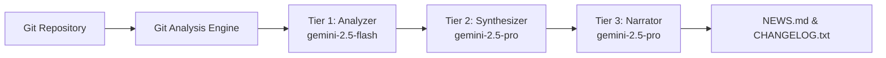

# Git AI Reporter

<div class="md-hero">
  <div align="center">
    
  </div>
  <h1>Git AI Reporter</h1>
  <p>Transform your Git history into intelligent, audience-aware documentation using AI</p>
  <div class="md-hero-buttons">
    <a href="getting-started.md" class="md-hero-button">Get Started</a>
    <a href="https://github.com/paudley/git-ai-reporter" class="md-hero-button md-hero-button--secondary">View on GitHub</a>
  </div>
</div>

<div class="badges" align="center">
  <span class="badge badge--python">Python 3.12+</span>
  <span class="badge badge--mit">MIT License</span>
  <span class="badge badge--stable">Production Ready</span>
  <span class="badge badge--ai">Powered by Gemini</span>
  <span class="badge badge--coverage-high" data-coverage="Core">Test Coverage</span>
</div>

---

## 🎯 What is Git AI Reporter?

**Git AI Reporter** is an AI-driven command-line tool that analyzes Git repository history and automatically generates high-quality development documentation. Using Google's Gemini models and a sophisticated three-tier AI architecture, it transforms raw commit data into polished, audience-specific narratives.

<div class="feature-grid">
  <div class="feature-card">
    <h3><span class="feature-icon">📰</span> NEWS.md</h3>
    <p>Narrative, stakeholder-friendly development summaries that tell the story of your project's evolution</p>
  </div>
  
  <div class="feature-card">
    <h3><span class="feature-icon">📋</span> CHANGELOG.txt</h3>
    <p>Structured, Keep a Changelog compliant change lists with intuitive emoji categorization</p>
  </div>
  
  <div class="feature-card">
    <h3><span class="feature-icon">📅</span> DAILY_UPDATES.md</h3>
    <p>Daily development activity summaries that capture the rhythm of your development process</p>
  </div>
</div>

## ✨ Key Features

### 🧠 **Three-Tier AI Architecture**
Our sophisticated multi-tier system balances performance, cost, and quality:

- **Tier 1 - Analyzer** (gemini-2.5-flash): High-volume, fast analysis of individual commits
- **Tier 2 - Synthesizer** (gemini-2.5-pro): Pattern recognition and daily summaries
- **Tier 3 - Narrator** (gemini-2.5-pro): Polished, audience-specific content generation

### 🔍 **Multi-Lens Analysis**
Analyze your repository through three complementary perspectives:

- **Micro View**: Individual commit analysis with intelligent filtering
- **Mezzo View**: Daily consolidation showing net changes per 24-hour period
- **Macro View**: Weekly overview providing complete context for narratives

### ⚡ **Performance & Efficiency**
- **Smart Caching**: Minimize API costs with intelligent response caching
- **Async Processing**: 5-10x performance improvement for large repositories
- **Batch Operations**: Process multiple commits concurrently with semaphore control
- **Progress Tracking**: Real-time progress bars with ETA calculations

### 🔒 **Enterprise Ready**
- **Supply Chain Security**: Digital attestations for PyPI packages
- **Type Safety**: 100% type annotated with strict mypy checking
- **Comprehensive Testing**: Extensive test coverage with deterministic testing
- **Clean Architecture**: Strict separation of domain, application, and infrastructure layers


## 🚀 Quick Start

### Install from PyPI

```bash
pip install git-ai-reporter
```

### Configure API Key

```bash
# Set your Gemini API key
export GEMINI_API_KEY="your-api-key-here"
```

### Run Analysis

```bash
$ git-ai-reporter
Git AI Reporter v0.1.0
Analyzing repository: /current/directory
Processing 127 commits...
Analysis complete!
Generated: NEWS.md, CHANGELOG.txt, DAILY_UPDATES.md
```

## 🛠️ Use Cases

- **Release Notes Generation**: Automatically create professional release notes from your Git history
- **Sprint Summaries**: Generate sprint retrospectives and progress reports
- **Stakeholder Updates**: Create non-technical summaries for management and clients
- **Documentation Automation**: Keep your changelog and news files always up-to-date
- **Development Insights**: Identify patterns and trends in your development process

## 🏗️ Architecture Overview



## 🤝 Community & Support

<div class="feature-grid">
  <div class="feature-card">
    <h3><span class="feature-icon">🐛</span> Report Issues</h3>
    <p>Found a bug? <a href="https://github.com/paudley/git-ai-reporter/issues">Report it on GitHub</a></p>
  </div>
  
  <div class="feature-card">
    <h3><span class="feature-icon">💡</span> Request Features</h3>
    <p>Have an idea? <a href="https://github.com/paudley/git-ai-reporter/discussions">Join the discussion</a></p>
  </div>
  
  <div class="feature-card">
    <h3><span class="feature-icon">📧</span> Contact</h3>
    <p>Need help? <a href="mailto:paudley@blackcat.ca">Email the maintainer</a></p>
  </div>
</div>

## 📚 Documentation

Explore our comprehensive documentation to get the most out of Git AI Reporter:

- **[Getting Started](getting-started.md)** - Quick installation and setup guide
- **[User Guide](guide/index.md)** - Detailed usage instructions and examples
- **[CLI Reference](cli/index.md)** - Complete command-line interface documentation
- **[API Reference](api/index.md)** - Python API documentation for developers
- **[Architecture](architecture/index.md)** - Deep dive into the system design
- **[Development](development/index.md)** - Contributing guidelines and development setup

## 🎯 Ready to Transform Your Git History?

<div class="md-hero-buttons" style="text-align: center; margin-top: 2rem;">
  <a href="getting-started.md" class="md-hero-button">Get Started Now</a>
  <a href="installation/index.md" class="md-hero-button md-hero-button--secondary">Installation Guide</a>
</div>

---

<div align="center">
  <p>Made with ❤️ by the Git AI Reporter Team</p>
  <p>If you find this project useful, please consider giving it a ⭐ on <a href="https://github.com/paudley/git-ai-reporter">GitHub</a>!</p>
</div>